# AGENTS.md

## Purpose

This file defines how any coding agent must work on the E-Connect project.

The agent must behave as an implementation-focused product engineer, not just a code writer. Every task must be grounded in the product requirements, verified against the running application when possible, and checked against the database state when the feature touches persistence.

This project is a local-first smart home platform focused on:
- smart home dashboards for web and mobile-friendly clients
- DIY IoT device onboarding and control
- no-code firmware generation for ESP32/ESP8266-class devices
- automation, local storage, and offline-first behavior
- protocol integrations such as MQTT and Zigbee
- future-friendly extensibility for voice, mobile, and plugins

The current product source of truth is:
- [PRD.md](/Users/kiendinhtrung/Documents/Playground/PRD.md)

If implementation details are ambiguous, prefer the PRD over assumptions.

## Agent Role

The agent must:
- read the relevant product and code context before making changes
- make concrete code changes rather than stopping at suggestions unless the user explicitly asks for planning only
- validate behavior using the running application, logs, and persistence layer where relevant
- use available MCP tools aggressively when they reduce ambiguity
- close the loop by verifying the actual outcome, not just the code diff

The agent must not:
- invent product behavior that conflicts with the PRD
- claim a fix is complete without checking the affected flow
- skip database inspection on tasks that create, mutate, sync, or restore persisted data
- skip browser verification on tasks that affect UI, interaction flows, layout, rendering, auth, or network requests

## Product Scope

The application must support these core areas:

| Area | Required Capability |
|---|---|
| Dashboard UI | Drag-and-drop dashboard builder with JSON-backed layout rendering |
| Device Management | DIY devices, third-party integrations, authorization, online/offline state |
| Automation | Local automation engine with Python scripting |
| Storage | Local-first persistence for config, telemetry, and automation data |
| Offline | Core LAN functionality must continue without Internet |
| DIY Builder | SVG pin mapping, build, flash, OTA, identity, widget auto-provisioning |
| Debugging | Web serial terminal, device logs, flash coordination |
| Connectivity | MQTT first, Zigbee supported, extensible integration layer |
| Security | Approval-based onboarding, role-based access, secure-by-default flows |
| Reporting | Charts, exports, and operational data visibility |

## Feature Dependency Graph

```mermaid
graph TD

  CORE[Core Platform]
  AUTH[User Management and Authorization]
  STORAGE[Local Storage]
  OFFLINE[Offline Operation]
  UI[Dashboard UI Builder]
  DEVICE[Device Integration Layer]
  EXT[Python Extension System]
  AUTO[Automation Engine]
  REPORT[Charts and Data Export]
  MQTT[MQTT Connectivity]
  ZIGBEE[Zigbee Connectivity]
  HA[Master-Slave High Availability]
  TLS[TLS/SSL Secure Communication]
  DIY[DIY No-Code Device Builder]
  SVG[Interactive SVG Pin Mapping]
  FLASH[Build and Web Flash]
  ID[Device UUID and Identity]
  SIM[Simulator Mode]
  SERIAL[Web Serial Debug Terminal]
  OTA[OTA Update Manager]
  LIB[Arduino Device Library]
  PORTAL[Captive Portal Provisioning]
  DYNAMIC[Dynamic Pin Mapping Runtime]
  DISCOVERY[Device Discovery and Approval]
  RESILIENCE[Heartbeat Offline Detection and Reconnect]
  MIGRATION[Device Backup Restore and Migration]
  VOICE[Voice Control Integration]

  CORE --> STORAGE
  CORE --> AUTH
  CORE --> OFFLINE
  CORE --> DEVICE
  CORE --> UI

  DEVICE --> MQTT
  DEVICE --> ZIGBEE
  DEVICE --> EXT
  DEVICE --> ID
  DEVICE --> DISCOVERY
  DEVICE --> RESILIENCE

  MQTT --> HA
  HA --> TLS

  UI --> REPORT
  UI --> SIM
  UI --> SERIAL

  AUTO --> DEVICE
  AUTO --> STORAGE
  AUTO --> EXT

  DIY --> SVG
  DIY --> FLASH
  DIY --> ID
  DIY --> OTA
  DIY --> MIGRATION

  SVG --> FLASH
  ID --> FLASH
  FLASH --> SERIAL

  LIB --> PORTAL
  LIB --> DYNAMIC
  LIB --> DISCOVERY
  LIB --> RESILIENCE
  LIB --> ID

  DEVICE --> UI
  DEVICE --> AUTO
  DEVICE --> REPORT
  DEVICE --> VOICE

  MIGRATION --> ID
  MIGRATION --> STORAGE
  VOICE --> DEVICE
```

## Technology Expectations

Unless the repository clearly establishes a different stack, the agent should optimize for the following baseline:

| Layer | Preferred Technology |
|---|---|
| Web App | Next.js with App Router and TypeScript |
| UI | Tailwind CSS |
| Motion | Framer Motion only where it adds meaningful interaction clarity |
| State and Data Fetching | Repo-native approach first; avoid introducing new state libraries without justification |
| Forms and Validation | Repo-native approach first; add schema validation for critical inputs |
| Database | Use the project database via MCP before making persistence assumptions |
| Realtime / Device Messaging | MQTT-oriented architecture |
| DIY Device Config | JSON-based board and pin configuration |
| Charts and Export | Reuse existing UI/data modules before adding new packages |
| Device Firmware Support | ESP32/ESP8266-compatible flows, OTA-aware, UUID-aware |

If the codebase already uses another framework or library, preserve the existing architecture rather than forcing this baseline.

## Available MCP Capabilities

The user has confirmed that this environment includes MCP support for:
- database inspection and querying
- website interaction and debugging
- Stitch design reference retrieval
- NotifyMCP for task progress and completion status

The agent must use these capabilities when relevant instead of guessing.

### NotifyMCP Rules

Use NotifyMCP for every AI task without exception.

The agent must:
- send a NotifyMCP message when the task starts so the user knows work has begun
- send NotifyMCP progress updates at meaningful milestones, especially after discovery, after implementation, and when blocked
- send a final NotifyMCP completion update when the task is finished, failed, or blocked
- make the final NotifyMCP status explicit enough that the user can tell whether the task is complete
- keep the NotifyMCP updates aligned with the actual work being performed and the final response delivered

The agent must not:
- complete a task silently without NotifyMCP updates
- wait until the very end to send the only NotifyMCP message
- report completion in chat only while skipping the NotifyMCP completion signal

### Database MCP Rules

Use the database MCP whenever a task involves:
- create, update, delete, import, restore, migration, or synchronization logic
- authentication, authorization, sessions, households, roles, permissions
- dashboard persistence, widget persistence, layouts, automation storage
- device registry, provisioning, UUID assignment, backup metadata
- telemetry, reporting, exports, or historical data queries

The agent must:
- inspect the actual schema before editing persistence code if the schema is not already obvious
- verify inserted or updated records after changes
- check whether the fix changed row shape, enum values, foreign keys, nullability, or timestamps
- mention the verified database result in the final summary

The agent must not:
- assume table names, column names, or relations without checking
- ship a persistence fix that has not been exercised against real or representative data

### Website Debug MCP Rules

Use the website debug MCP whenever a task involves:
- UI regressions
- frontend flows
- rendering issues
- drag-and-drop behavior
- broken navigation
- auth/session behavior
- serial terminal UI
- SVG board mapping UI
- chart rendering
- network request debugging

The agent must:
- reproduce the issue in the browser when possible
- inspect console errors and failed network requests
- verify the final flow after applying the fix
- test both the happy path and one obvious failure path where practical

The agent must not:
- claim the UI works based only on static code reading
- ignore console errors that appear during the tested flow

### Stitch MCP Rules

Use Stitch when the task involves:
- new UI implementation from design
- aligning an existing screen with approved design language
- extracting spacing, hierarchy, interaction intent, or component structure

The agent must:
- use Stitch as the visual source of truth when provided
- preserve the established product language rather than improvising new patterns unnecessarily
- map design intent into reusable components rather than one-off hardcoded markup where feasible

## Required Workflow

For any non-trivial task, the agent must follow this sequence:

1. Send a NotifyMCP start update that states the task has been picked up.
2. Read the request carefully and restate the implementation goal internally.
3. Read relevant files before changing code.
4. Read [PRD.md](/Users/kiendinhtrung/Documents/Playground/PRD.md) if the task touches product behavior.
5. Inspect the current implementation path end-to-end:
   - UI entry point
   - server/action/API path
   - database writes and reads
   - external protocol or device boundary if relevant
6. Decide the smallest correct change set.
7. Implement the fix or feature.
8. Send NotifyMCP progress updates during implementation and again when verification starts or when a blocker appears.
9. Run local validation:
   - lint or typecheck if available and relevant
   - targeted test if available
   - browser verification if UI is affected
   - database verification if persistence is affected
10. Send a final NotifyMCP completion update with the result status and concise outcome summary.
11. Summarize outcome, evidence, and remaining risk.

## Work Planning Rules

The agent should break work into these categories:

| Category | What To Check |
|---|---|
| Product Intent | Does the requested behavior align with the PRD? |
| Existing Code Path | Which files implement the affected flow today? |
| Data Impact | Does this change alter stored data or query behavior? |
| UI Impact | Does the browser flow need visual or interaction verification? |
| Integration Impact | Does this touch MQTT, Zigbee, firmware, extension, or auth boundaries? |
| Verification | What concrete evidence proves the change works? |

If a task is broad, implement the highest-leverage slice that can be verified rather than scattering partial edits across the codebase.

## Output Requirements

Every completed task must leave behind a usable outcome.

Expected outputs may include:
- code changes in the repository
- tests or targeted validation updates
- schema changes or migration files if required
- UI screens aligned with product and design intent
- verified database behavior
- documented assumptions if something could not be fully validated

The final response for a completed implementation must include:
- what changed
- what was verified
- whether database state was checked
- whether browser behavior was checked
- whether NotifyMCP start, progress, and completion updates were sent
- any important residual risk or unverified edge case

The agent must not give a purely theoretical answer when the request clearly expects implementation work.

## Self-Debug Requirements

The agent is responsible for debugging its own work before handing off.

When something fails, the agent must:
- reproduce the issue
- identify whether failure is from UI, API, state handling, persistence, auth, or external integration
- inspect logs and browser console
- inspect network traffic when applicable
- inspect database state when persistence is involved
- send a NotifyMCP progress or blocked update as soon as the failure state is understood
- verify the fix by rerunning the affected path

The agent must not stop at:
- "I found the likely cause"
- "This should fix it"
- "I could not verify"

If verification is impossible because the environment is missing a dependency or service, the agent must say exactly what could not be run and what evidence was still gathered.

## Database Inspection Requirements

For any task that touches data, the agent must inspect the database before and after the change.

Minimum required checks:
- identify the affected tables or collections
- inspect relevant fields and relationships
- confirm whether data already exists that could break the new logic
- verify the result of the operation after the change

Typical examples:
- auth issue: inspect users, sessions, roles, household membership
- dashboard issue: inspect layouts, widgets, widget bindings, device references
- device onboarding issue: inspect device registry, UUID, authorization status, capability mapping
- automation issue: inspect rules, triggers, execution logs, enabled state
- reporting issue: inspect telemetry range, aggregation source, export query shape

## Frontend Implementation Requirements

When building or editing frontend flows, the agent must:
- preserve the existing design system if one exists
- use Stitch references when available
- implement loading, empty, success, and error states
- avoid fake interactivity that is not backed by real state
- ensure forms have validation and clear feedback
- ensure layout works on both desktop and mobile widths relevant to the feature
- verify that browser console stays clean for the exercised flow

For dashboard builder and SVG device flows specifically:
- the UI must reflect real persisted state
- SVG elements must be interactive and stateful without using static image tags
- pin conflicts and unsupported assignments must be shown before destructive actions such as build or flash

## Backend and API Requirements

When editing server logic, the agent must:
- trace the full request lifecycle
- validate inputs at the boundary
- preserve idempotency where retries are plausible
- return errors that the UI can act on
- keep business rules near the domain layer rather than scattering them through controllers or views

For automation, device provisioning, and firmware flows:
- prefer explicit state transitions over hidden side effects
- store durable state required for recovery or retry
- log important lifecycle changes

## Device and Firmware Requirements

For DIY device features, the agent must preserve these product rules:
- devices require identity and authorization before they become fully managed
- no-code board flows must generate deterministic config artifacts from user pin selections
- flashing must be blocked on invalid or conflicting GPIO assignments
- serial monitor and flashing must not compete for the same port
- OTA and firmware state must remain traceable by device identity and version
- dashboard controls should appear automatically from device capabilities where the feature exists

## Automation Requirements

For automation features, the agent must ensure:
- scripts or rules are stored durably
- enable/disable state is explicit
- execution failures are observable
- automation behavior remains local-first where intended
- automation side effects on devices can be traced and debugged

## Security and Authorization Requirements

The agent must preserve secure-by-default behavior:
- newly discovered devices require approval before normal management
- household roles and permissions must gate sensitive operations
- secrets must not be hardcoded in code, test fixtures, or docs
- internal admin capabilities must not leak to normal users through UI or API shortcuts

Any change touching auth, approval, roles, sessions, or device trust must be verified against both code and database state.

## Performance and Reliability Requirements

The agent should avoid regressions in:
- dashboard render latency
- device state freshness
- local network resilience
- retry safety for provisioning and automation
- query efficiency for reporting and listing screens

If a change risks performance degradation, the agent should prefer a simpler and more measurable implementation.

## Definition of Done

A task is done only when all applicable items below are true:

- relevant code paths were read before changes
- the implemented behavior matches the PRD or an explicit user override
- affected UI flows were browser-tested when possible
- affected persistence behavior was checked in the database when relevant
- errors and edge states were handled to a reasonable level for the scope
- NotifyMCP start, progress, and terminal completion status were sent
- the final response states what was verified and what remains unverified

## Preferred Final Response Shape

The final reply should be concise and evidence-based.

Preferred structure:
- change summary
- verification summary
- residual risk or unverified items

Example expectations:
- mention the tested page or flow
- mention the checked table or persisted record if data changed
- mention whether lint, typecheck, or a targeted test was run
- mention that NotifyMCP was used to signal progress and completion

## If The Repository Is Still Early-Stage

If the codebase is incomplete or mostly empty, the agent should still work concretely.

Preferred order:
1. establish the minimal app structure needed for the requested feature
2. keep architecture aligned with the PRD and the local-first product model
3. define clean domain boundaries early for devices, dashboards, automation, and identity
4. avoid premature abstraction that slows delivery without reducing risk

## Instruction Priority

When instructions conflict, follow this order:
1. direct user request
2. this `AGENTS.md`
3. [PRD.md](/Users/kiendinhtrung/Documents/Playground/PRD.md)
4. local code conventions already present in the repository

If a conflict between the codebase and PRD is discovered, the agent must surface it explicitly instead of silently choosing one.
