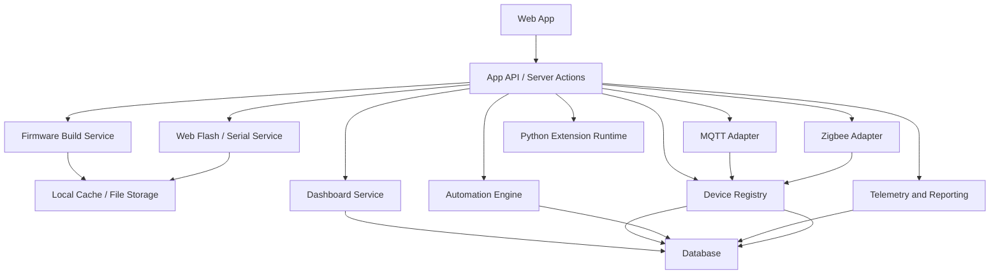

# INITIAL_ARCHITECTURE.md

## Purpose

This document defines the recommended initial architecture for the E-Connect project so implementation can start with stable boundaries and minimal rework.

It is intentionally practical. The goal is not to design every future subsystem up front, but to establish clean domain seams for:
- dashboard rendering and editing
- device onboarding and lifecycle management
- automation execution
- local-first persistence
- protocol adapters such as MQTT and Zigbee
- DIY firmware generation, flashing, and debugging

## Architecture Principles

| Principle | Meaning |
|---|---|
| Local-first | Core control, automation, and dashboards must work on LAN without Internet |
| Product-aligned | Architecture must follow the PRD, especially DIY onboarding and self-hosted control |
| Verifiable | Each major flow must be testable through UI, API, and persistence boundaries |
| Replaceable integrations | MQTT, Zigbee, OTA, and third-party APIs should sit behind adapters |
| Durable state | Device identity, dashboard config, automation state, and provisioning status must be persisted |
| Explicit lifecycle | Device onboarding, authorization, flash, and automation execution must have clear states |

## Recommended System Shape



## Recommended Top-Level Modules

| Module | Responsibility |
|---|---|
| `app` or `src/app` | Routes, pages, layouts, server actions, API endpoints |
| `features/dashboard` | Dashboard builder, widget configuration, layout persistence |
| `features/devices` | Device registry, onboarding, authorization, capability mapping |
| `features/automation` | Automation CRUD, execution, logs, scheduling hooks |
| `features/diy` | Board profiles, pin mapping, config generation, build/flash flows |
| `features/reporting` | Charts, exports, telemetry queries |
| `features/auth` | Users, households, roles, permissions, sessions |
| `lib/db` | Database access, schema adapters, query helpers |
| `lib/protocols` | MQTT, Zigbee, and future protocol adapters |
| `lib/extensions` | Python extension loading and execution boundaries |
| `lib/validation` | Shared input validation and domain schema parsing |
| `components` | Shared presentational and composable UI pieces |

## Domain Boundaries

### Dashboard Domain

Owns:
- layouts
- widgets
- widget bindings
- dashboard views
- dashboard editing state persisted to storage

Must not own:
- raw device transport logic
- automation execution internals

Depends on:
- device capability read models
- reporting read models

### Device Domain

Owns:
- device identity
- authorization status
- connectivity status
- capability definitions
- registry and discovery state
- board metadata for DIY devices

Must not own:
- page rendering concerns
- chart aggregation logic

Depends on:
- protocol adapters
- storage

### Automation Domain

Owns:
- automation definitions
- triggers
- enabled state
- execution logs
- automation-to-device action mapping

Must not own:
- direct widget rendering

Depends on:
- device domain
- storage
- extension runtime for Python scripts

### DIY Domain

Owns:
- board profiles
- SVG pin metadata
- pin assignment rules
- generated config artifacts
- build job state
- flash job state
- OTA metadata

Must not own:
- generalized household auth logic

Depends on:
- device identity
- file storage
- browser serial and build services

## Recommended Data Model Areas

Exact schema should follow the chosen database technology, but the system will likely need these entity groups:

| Area | Core Entities |
|---|---|
| Auth | users, households, memberships, roles, sessions |
| Dashboard | dashboards, dashboard_layouts, widgets, widget_bindings |
| Devices | devices, device_capabilities, device_status, device_authorizations |
| DIY | board_profiles, board_pins, diy_projects, diy_pin_assignments, firmware_builds, flash_sessions |
| Automation | automations, automation_runs, automation_logs, automation_bindings |
| Reporting | telemetry_events, telemetry_series, exports |
| System | audit_logs, files, extension_configs, protocol_connections |

## Lifecycle Recommendations

### DIY Device Onboarding

```text
draft project
-> board selected
-> pins assigned
-> config validated
-> build queued
-> build succeeded
-> flash requested
-> flashed
-> device discovered
-> authorization pending
-> authorized
-> dashboard widgets provisioned
-> active
```

### Automation Lifecycle

```text
draft
-> validated
-> enabled
-> triggered
-> running
-> succeeded or failed
-> disabled or archived
```

### Device Connectivity Lifecycle

```text
discovered
-> pending authorization
-> authorized
-> online
-> degraded
-> offline
-> reconnected
```

## API Design Guidance

Prefer vertical slice APIs over generic catch-all handlers.

Recommended API areas:
- dashboard CRUD and layout persistence
- widget binding and capability lookup
- device discovery and authorization
- device list and detail read models
- automation CRUD and execution logs
- firmware build and flash job control
- serial terminal session endpoints
- telemetry and export endpoints

Rules:
- validate input at the boundary
- return machine-actionable error shapes
- preserve idempotency for retry-prone operations
- separate command endpoints from query endpoints where practical

## Frontend Design Guidance

For the first implementation:
- optimize for responsive web first
- keep mobile web usable even if native apps come later
- avoid fake dashboards backed only by mock data once a real path exists
- keep builder interactions deterministic and persisted
- prefer reusable control widgets with explicit device binding contracts

For SVG board mapping:
- use inline or component-rendered SVG, not static image tags
- keep pin metadata structured
- surface capability warnings before build or flash
- preserve selected pin state from persisted config

## Infrastructure Guidance

The initial architecture should remain simple:
- one app service for web and application logic is acceptable
- one database
- one local file storage area for generated artifacts, exports, and logs
- one MQTT broker if MQTT is enabled

Do not split into microservices early unless operational constraints clearly require it.

## Verification Strategy

Every feature slice should be validated across these layers when applicable:

| Layer | Verification Method |
|---|---|
| UI | Browser interaction, console check, visible state transition |
| API | Request/response inspection, error-path check |
| Database | Inspect created or updated records with MCP |
| Device/Protocol | Verify discovery, state update, or emitted command path |
| Files/Artifacts | Verify generated JSON, build outputs, export files, or logs |

## Early Milestone Recommendation

Build in this order:

1. auth and household basics
2. device registry and authorization flow
3. dashboard read model and simple control widgets
4. MQTT-based control and state sync
5. DIY board profile and SVG pin mapping
6. build/flash workflow with UUID-backed registration
7. automation creation and execution logs
8. reporting and exports
9. OTA and advanced migration flows

## Anti-Patterns To Avoid

- coupling dashboard widgets directly to transport-specific code
- putting business rules in UI components
- mixing discovery state and authorization state into a single ambiguous flag
- hiding long-running firmware steps behind synchronous request flows
- skipping persisted job state for build, flash, OTA, or export operations
- relying only on in-memory state for device status that users need to inspect later

