# Product Requirements Document (PRD)

## Econnect - Self-hosted Smart Home Ecosystem Dashboard

**Version:** 1.0  
**Status:** Draft / In Development  
**Owner:** Product / Founder  
**Last Updated:** 2026-03-01

---

## 1. Executive Summary

Econnect là một nền tảng smart home self-hosted cho phép người dùng quản lý, điều khiển, giám sát và mở rộng các thiết bị IoT trong nhà, đặc biệt tập trung vào hệ sinh thái DIY sử dụng ESP32/ESP8266. Sản phẩm cung cấp một dashboard web trung tâm, khả năng tạo firmware no-code cho thiết bị DIY, cơ chế tự động hóa bằng script, tích hợp giao thức phổ biến như MQTT/Zigbee, và định hướng mở rộng sang mobile app trong tương lai.

Mục tiêu của Econnect là trở thành một giải pháp trung gian giữa:

- Các nền tảng quá kỹ thuật đối với người mới như Home Assistant, Domoticz.
- Các nền tảng đóng hoặc khó mở rộng cho nhu cầu DIY như Blynk.

Econnect hướng tới trải nghiệm "local-first", ưu tiên hoạt động trong mạng nội bộ, không phụ thuộc cloud cho các chức năng cốt lõi, đồng thời đủ linh hoạt để phục vụ cả người dùng không biết lập trình lẫn người dùng nâng cao.

---

## 2. Product Vision

### 2.1 Vision

Xây dựng một hệ sinh thái smart home self-hosted nơi người dùng có thể:

- Tự tạo và quản lý thiết bị IoT DIY một cách trực quan.
- Điều khiển toàn bộ thiết bị trong nhà từ một dashboard hợp nhất.
- Tự động hóa hành vi thiết bị bằng logic đơn giản hoặc script.
- Mở rộng hệ thống bằng plugin, giao thức mở và firmware tùy biến.

### 2.2 Mission

Giảm rào cản phát triển và vận hành smart home DIY bằng cách cung cấp:

- Giao diện cấu hình trực quan.
- Trải nghiệm tích hợp thiết bị thống nhất.
- Luồng build, flash, giám sát và bảo trì thiết bị trong một hệ thống duy nhất.

### 2.3 Product Principles

- **Local-first:** Chức năng chính phải hoạt động được khi mất Internet.
- **DIY-friendly:** Tối ưu cho người dùng tự chế phần cứng bằng ESP32/ESP8266.
- **Extensible:** Kiến trúc phải cho phép mở rộng device type, plugin và automation.
- **Beginner-to-Pro:** Vừa hỗ trợ no-code, vừa hỗ trợ pro-code.
- **Secure-by-default:** Thiết bị mới phải được cấp quyền rõ ràng trước khi quản lý.

---

## 3. Problem Statement

### 3.1 Current Problems

Hiện tại, người dùng DIY smart home thường gặp các khó khăn sau:

- Quá trình phát triển firmware cho ESP32/ESP8266 còn phức tạp đối với người mới.
- Các nền tảng như Blynk chưa tối ưu cho nhu cầu xây dựng một dashboard điều khiển thống nhất cho toàn bộ nhà.
- Nhiều giải pháp hiện có mạnh nhưng khó tiếp cận, yêu cầu cấu hình sâu hoặc kiến thức hệ thống lớn.
- Người dùng thiếu một nền tảng chung để:
  - khai báo thiết bị DIY,
  - cấu hình chức năng GPIO trực quan,
  - build/flash firmware,
  - theo dõi trạng thái thiết bị,
  - quản lý dashboard và automation tại cùng một nơi.

### 3.2 Opportunity

Econnect giải quyết khoảng trống giữa "nền tảng dễ bắt đầu" và "nền tảng đủ mạnh để mở rộng". Sản phẩm tạo ra một lớp điều phối thống nhất giữa dashboard, thiết bị DIY, giao thức nhà thông minh và automation nội bộ.

---

## 4. Goals and Non-Goals

### 4.1 Product Goals

- Cho phép người dùng thêm, xóa, quản lý và điều khiển thiết bị IoT DIY qua web dashboard.
- Cung cấp no-code builder để tạo firmware từ cấu hình board và GPIO mapping.
- Hỗ trợ thiết bị bên thứ ba thông qua API public hoặc extension.
- Hỗ trợ local automation và local data storage.
- Đảm bảo hệ thống hoạt động ổn định trong mạng nội bộ ngay cả khi mất Internet.
- Tạo nền tảng mở để mở rộng mobile app, voice control và hệ sinh thái plugin trong tương lai.

### 4.2 Non-Goals for Initial Release

- Không ưu tiên cloud SaaS multi-tenant ở giai đoạn đầu.
- Không cạnh tranh trực diện với toàn bộ hệ sinh thái enterprise IoT platform.
- Không hỗ trợ toàn bộ giao thức nhà thông minh ngay từ phiên bản đầu.
- Không nhắm tới automation phức tạp cấp công nghiệp hoặc visual workflow engine hoàn chỉnh trong giai đoạn đầu.

---

## 5. Target Users

### 5.1 Primary Users

- Người dùng 18-35 tuổi thích DIY, electronics, home automation.
- Người đã hoặc đang sử dụng ESP32/ESP8266 cho dự án cá nhân.
- Người muốn tự host hệ thống smart home tại nhà.

### 5.2 Secondary Users

- Maker, sinh viên kỹ thuật, kỹ sư embedded.
- Người dùng đang dùng Blynk nhưng muốn linh hoạt hơn.
- Người dùng Home Assistant muốn có trải nghiệm DIY builder đơn giản hơn.

### 5.3 Personas

#### Persona A - DIY Beginner

- Có kiến thức cơ bản về ESP32.
- Muốn bật/tắt relay, đọc sensor nhiệt độ/độ ẩm mà không muốn viết nhiều code.
- Cần giao diện kéo thả và cấu hình trực quan.

#### Persona B - Advanced Maker

- Có thể viết Arduino/C++ hoặc Python.
- Muốn tự viết firmware hoặc extension riêng.
- Cần API mở, thư viện Arduino và automation script.

#### Persona C - Home Power User

- Muốn quản lý thiết bị trong gia đình với role-based access.
- Quan tâm dashboard, báo cáo, ổn định và backup/restore.

---

## 6. User Needs

- Tôi muốn thêm một thiết bị DIY mới mà không phải cấu hình thủ công quá nhiều.
- Tôi muốn map GPIO trên giao diện trực quan thay vì ghi nhớ pin bằng tay.
- Tôi muốn sau khi flash xong thì dashboard tự tạo control tương ứng.
- Tôi muốn hệ thống vẫn điều khiển được thiết bị khi Internet bị mất.
- Tôi muốn quản lý dữ liệu cảm biến, biểu đồ và xuất báo cáo.
- Tôi muốn thiết bị mới phải được duyệt trước khi tham gia hệ thống.
- Tôi muốn có cả chế độ no-code và pro-code.

---

## 7. Scope

### 7.1 In Scope

- Dashboard quản lý thiết bị smart home.
- Device onboarding cho thiết bị DIY.
- No-code firmware builder cho ESP-based board.
- SVG pin mapping.
- OTA, serial monitor, build/flash từ web.
- Local storage, offline mode, automation, reporting.
- Hỗ trợ MQTT và Zigbee.
- User management theo household.

### 7.2 Out of Scope

- App mobile native ở phiên bản đầu.
- Cloud-hosted account federation.
- Marketplace plugin public hoàn chỉnh.
- AI automation generation hoặc LLM assistant tích hợp sẵn.

---

## 8. Feature Summary

| ID | Module | Required Functionality | Description | Expected Behavior / Constraints |
|---|---|---|---|---|
| FR-01 | UI Builder | Dashboard builder must support drag-and-drop grid layout editing. | Users can compose dashboards by placing widgets such as switch, gauge, slider, chart, and other control or display components. | The system must persist layout configuration as JSON and render the same structure consistently on both web and mobile clients. |
| FR-02 | UI Builder | The application must generate UI configuration automatically from user layout actions. | Layout editing should not require manual JSON editing by end users. | Generated JSON must be valid, portable, and reusable across sessions and devices. |
| FR-03 | Device Ecosystem | The platform must support DIY IoT devices and third-party devices with public APIs. | Users can connect custom-built hardware as well as supported external ecosystems such as Yeelight. | The integration model must allow adding new device types without changing core application flows. |
| FR-04 | Extension System | The platform must support Python-based extensions declared through JSON configuration. | Advanced users can script custom integrations and define how devices are controlled. | Extensions must be isolated from the core device model and configurable through structured metadata. |
| FR-05 | Automation | The system must provide Python-scriptable automation workflows. | Users can create automation logic such as conditional actions based on presence, temperature, or device state. | The web app must include an embedded script editor suitable for short automation scripts. |
| FR-06 | Storage | The platform must store operational data locally. | Device data, automation data, and configuration data are persisted on local storage controlled by the user. | Storage limits depend on host capacity; the system should avoid requiring cloud persistence for core operation. |
| FR-07 | Offline Mode | Core application functions must continue operating without Internet access. | Local control, local automation, and local dashboards should remain available during Internet outages. | Internet loss must not break local device control within the local network. |
| FR-08 | User Management | The application must support family or household user management with role-based access. | Different users in the same household can have different permissions. | Authorization rules must apply to device control, configuration, and administration actions. |
| FR-09 | OTA | The platform must support OTA firmware management for ESP-based DIY devices. | Users can update device firmware remotely through the platform. | OTA flows must be integrated with device identity, version tracking, and deployment status reporting. |
| FR-10 | Reporting | The application must provide chart widgets and exportable reports. | Users can view device, sensor, and automation data on charts and export records to Excel or CSV. | Export must be available directly from the UI without requiring manual database access. |
| FR-11 | Connectivity | The platform must support MQTT and Zigbee connectivity. | Devices can communicate through standard home automation protocols. | The architecture must allow local broker-based communication and Zigbee gateway integration. |
| FR-12 | High Availability | The platform should support master-slave server topology for local scaling and failover. | Multiple local servers can cooperate to expand control range and maintain availability. | Slave nodes may host Zigbee USB adapters; failover must allow a slave to temporarily assume master responsibilities. |
| FR-13 | Secure Sync | Inter-server communication must support TLS/SSL protection. | Master-slave coordination and message exchange must be protected in transit. | MQTT-based server synchronization must not rely on plaintext communication in production deployments. |
| FR-14 | DIY No-Code Builder | The platform must provide a no-code firmware generation flow for DIY devices. | Users select a board, assign GPIO functions visually, and build firmware without writing code. | The workflow must generate firmware from board profile, pin configuration JSON, and sample firmware templates. |
| FR-15 | Visual Pin Mapping | The application must provide interactive SVG-based board pin configuration. | Users configure GPIO roles directly on an SVG board diagram instead of static images. | The UI must support clickable pins, tooltips, capability warnings, and state coloring for already assigned pins. |
| FR-16 | Build and Flash | The application must compile and flash generated firmware directly from the web interface. | After mapping pins, users can trigger build-and-flash without leaving the platform. | The system must block flashing when GPIO assignments conflict or hardware constraints are invalid. |
| FR-17 | Device Identity | DIY devices must receive and persist a UUID-based identity. | Each generated or provisioned device is uniquely identified and validated by the platform. | UUID assignment must support authorization checks, online/offline tracking, and future restore or migration flows. |
| FR-18 | Auto Widget Provisioning | The dashboard must auto-create controls based on configured DIY device functions. | After a successful build/flash, the corresponding dashboard controls should appear without extra setup. | Widget creation must reflect assigned pin purpose such as switch, slider, or sensor. |
| FR-19 | DIY Backup and Restore | The system must support backup and restore of DIY device definitions. | Users can recover or migrate device identity and hardware profile using stored metadata. | Backups must include UUID, hardware pin mapping, metadata, and last firmware version. |
| FR-20 | Simulator Mode | The application should provide SVG-based simulation mode for dashboard interactions. | Users can test control logic visually before wiring physical hardware. | Example: toggling a dashboard light button should visually highlight the related pin on the SVG board. |
| FR-21 | Voice Control | The platform should support voice assistant integration. | The roadmap includes integration with services such as Google Home. | Voice support should be implemented through official APIs and mapped onto the same device/action model as local controls. |
| FR-22 | Serial Debugging | The web application must expose a browser-based serial terminal for supported DIY devices. | Users can inspect logs and send commands without relying on Arduino IDE or PuTTY. | The terminal must support selectable baud rate, auto-scroll, clear screen, text filtering, and proper UTF-8 or ANSI decoding. |
| FR-23 | Serial/Flash Coordination | The platform must prevent serial monitor conflicts during flashing. | Serial access and firmware flashing cannot compete for the same COM/USB resource. | The application must temporarily suspend serial monitoring while flash operations are active. |
| FR-24 | Arduino Library | The ecosystem must include a reusable Arduino/C++ library for device integration. | Advanced users can build custom firmware using a standard library rather than no-code generation. | The library must handle identity, connectivity, dynamic control mapping, and server handshake. |
| FR-25 | Captive Portal | DIY devices built with the library must support first-run captive portal provisioning. | Devices without Wi-Fi or device name configuration should expose a setup portal. | The portal must collect Wi-Fi credentials and device metadata, then persist them locally on the device. |
| FR-26 | Dynamic Pin Mapping | Library-based devices must accept pin/function mapping from the server at runtime. | Device firmware should not require all pins to be hard-coded in `setup()`. | The device must be able to receive configuration JSON and apply pin modes dynamically. |
| FR-27 | Device Discovery and Authorization | Newly connected DIY devices must require explicit approval from the platform. | When a new device appears, the server should notify the user and request authorization. | Authorization must result in identity issuance or registration before the device becomes fully managed. |
| FR-28 | Connection Resilience | DIY devices must support heartbeat, offline detection, and automatic reconnect. | The platform must detect unexpected disconnects and recover device connectivity without manual restarts. | Status reporting must update the dashboard when devices go offline or reconnect. |
| FR-29 | Device Migration | The platform should support migration from a failed DIY board to a replacement board. | Users can preserve dashboard bindings and automations when hardware is replaced. | Migration should allow restoring prior UUID or device profile under controlled conditions. |

---

## 9. Prioritization

### 9.1 MVP

- FR-01, FR-02: Dashboard builder cơ bản.
- FR-03: DIY device integration nền tảng.
- FR-05: Automation script cơ bản.
- FR-06, FR-07: Local storage và offline mode.
- FR-08: User management cơ bản.
- FR-11: MQTT connectivity.
- FR-14, FR-15, FR-16: No-code builder, SVG pin mapping, build/flash.
- FR-17, FR-18: Device identity và auto widget provisioning.
- FR-22, FR-23: Serial debugging và coordination khi flash.
- FR-27, FR-28: Discovery, authorization, reconnect.

### 9.2 Post-MVP

- FR-04: Python extension system.
- FR-09: OTA manager.
- FR-10: Reporting và export.
- FR-19, FR-20: Backup/restore và simulator mode.
- FR-24, FR-25, FR-26: Arduino library và captive portal.

### 9.3 Long-Term

- FR-12, FR-13: High availability và secure sync.
- FR-21: Voice control.
- FR-29: Device migration.

---

## 10. Core User Flows

### 10.1 DIY Device Onboarding Flow

1. Người dùng tạo thiết bị mới trên web.
2. Chọn board profile.
3. Cấu hình pin trên giao diện SVG.
4. Hệ thống kiểm tra conflict và capability của GPIO.
5. Người dùng build firmware.
6. Người dùng flash firmware từ giao diện web.
7. Thiết bị khởi động, kết nối mạng và gửi yêu cầu đăng ký.
8. Hệ thống yêu cầu người dùng duyệt thiết bị.
9. Sau khi duyệt, thiết bị nhận identity và xuất hiện trên dashboard.
10. Widget được tạo tự động theo chức năng đã cấu hình.

### 10.2 Dashboard Management Flow

1. Người dùng mở dashboard builder.
2. Kéo thả widget vào grid layout.
3. Gán widget với device capability hoặc sensor data.
4. Hệ thống tự sinh JSON config.
5. Layout được lưu và render nhất quán ở các client.

### 10.3 Automation Flow

1. Người dùng tạo rule/script automation.
2. Chọn trigger, điều kiện và action.
3. Script được lưu local.
4. Automation engine theo dõi state device/sensor.
5. Khi điều kiện thỏa mãn, action được thực thi.

### 10.4 Device Recovery Flow

1. Thiết bị bị lỗi hoặc thay board mới.
2. Người dùng chọn restore/migration từ backup.
3. Hệ thống phục hồi UUID, pin mapping, metadata và firmware version phù hợp.
4. Dashboard binding và automation tiếp tục hoạt động với can thiệp tối thiểu.

---

## 11. Functional Requirements Details

### 11.1 Dashboard and UI Builder

- Hỗ trợ layout dạng grid kéo thả.
- Hỗ trợ widget: switch, button, slider, gauge, chart, text status, power monitor.
- Lưu layout bằng JSON schema ổn định.
- Tái sử dụng layout trên nhiều client.
- Hỗ trợ auto-provision widget từ capability của thiết bị.

### 11.2 Device Management

- Quản lý danh sách thiết bị, loại thiết bị, trạng thái online/offline.
- Thêm/xóa/sửa metadata thiết bị.
- Cấp quyền cho thiết bị mới trước khi đưa vào quản lý.
- Theo dõi heartbeat và phát hiện mất kết nối.

### 11.3 DIY Firmware Builder

- Chọn board profile.
- Map GPIO bằng giao diện SVG tương tác.
- Kiểm tra pin conflict, pin capability, reserved pin.
- Sinh firmware từ template và JSON config.
- Build và flash trực tiếp từ web.

### 11.4 Developer / Pro-Code Support

- Extension bằng Python.
- Arduino/C++ library cho thiết bị tự viết firmware.
- Dynamic pin mapping từ server.
- Script editor nhúng cho automation ngắn.

### 11.5 Data and Reporting

- Lưu data cục bộ.
- Biểu đồ lịch sử sensor/device state.
- Xuất CSV/Excel từ UI.
- Hỗ trợ retention policy cấu hình được trong tương lai.

### 11.6 Operations and Maintenance

- OTA firmware update.
- Browser serial terminal.
- Backup/restore device definitions.
- Hỗ trợ simulator mode cho mạch và dashboard logic.

---

## 12. Non-Functional Requirements

### 12.1 Reliability

- Device registration success rate > 99%.
- Device control success rate > 95%.
- Firmware build success rate > 95%.
- Hệ thống phải có cơ chế reconnect và retry hợp lý cho thiết bị DIY.

### 12.2 Performance

- Thao tác điều khiển thiết bị trong mạng nội bộ nên phản hồi gần thời gian thực.
- Dashboard phải tải được trong thời gian chấp nhận được với số lượng thiết bị hộ gia đình thông thường.
- Việc render dashboard không được block bởi polling hoặc event stream quá mức.

### 12.3 Security

- Thiết bị mới phải được phê duyệt trước khi active.
- Phân quyền theo household role.
- Đồng bộ server-to-server phải dùng TLS/SSL ở production.
- Không lưu plaintext secret nếu có thể tránh.

### 12.4 Usability

- Người mới phải hoàn thành flow tạo thiết bị DIY đầu tiên mà không cần sửa code.
- Cảnh báo GPIO phải rõ ràng, dễ hiểu, không mang tính kỹ thuật quá mức.
- Giao diện dashboard builder cần trực quan và nhất quán.

### 12.5 Maintainability

- Kiến trúc module hóa để thêm device type mới mà không sửa core flow.
- JSON schema cho dashboard và device config phải versioned.
- Phần builder, device runtime và automation cần được tách lớp rõ ràng.

---

## 13. Assumptions and Constraints

### 13.1 Assumptions

- Người dùng có mạng nội bộ ổn định trong gia đình.
- Người dùng có quyền truy cập máy chủ self-hosted hoặc homelab.
- Thiết bị DIY chủ yếu dùng ESP32/ESP8266 ở giai đoạn đầu.
- MQTT sẽ là giao thức trọng tâm cho local messaging.

### 13.2 Constraints

- Tài nguyên host phụ thuộc vào phần cứng người dùng tự triển khai.
- Zigbee cần gateway hoặc USB coordinator tương thích.
- Web-based flashing và serial access phụ thuộc trình duyệt, OS và quyền truy cập USB/serial.
- Một số board có hạn chế GPIO đặc thù cần được encode vào board profile.

---

## 14. Risks and Mitigations

| Risk | Impact | Mitigation |
|---|---|---|
| Web flashing không ổn định trên mọi trình duyệt | Ảnh hưởng onboarding DIY | Giới hạn browser support rõ ràng, có fallback desktop helper nếu cần |
| Mapping GPIO sai gây lỗi phần cứng hoặc boot failure | Thiết bị không hoạt động | Tạo board rule engine và cảnh báo capability/reserved pin |
| Automation script làm giảm ổn định hệ thống | Ảnh hưởng runtime | Chạy sandbox hoặc isolate execution, giới hạn tài nguyên |
| Hỗ trợ nhiều device type quá sớm làm tăng độ phức tạp | Chậm tiến độ | Ưu tiên MQTT + ESP DIY trước, mở rộng dần |
| Offline-first nhưng vẫn cần update hoặc voice cloud integration | Kiến trúc xung đột | Tách core local khỏi optional cloud adapters |

---

## 15. Success Metrics

| Metric | Target |
|---|---|
| Device registration success rate | > 99% |
| Device control success rate | > 95% |
| Device firmware build success rate | > 95% |
| Time to first working DIY device | < 15 minutes |
| Device reconnect recovery rate | > 95% |
| Dashboard save/load consistency | 100% schema-compatible |

---

## 16. Release Strategy

### Phase 1 - MVP Foundation

- Core dashboard.
- MQTT-based device communication.
- User management cơ bản.
- Local storage và offline mode.
- DIY no-code builder bản đầu.

### Phase 2 - Maker Platform

- Serial terminal.
- OTA.
- Reporting/export.
- Python extension.
- Arduino library.

### Phase 3 - Ecosystem Expansion

- Zigbee integration.
- Voice control.
- High availability.
- Migration/restore nâng cao.
- Mobile companion app.

---

## 17. Open Questions

- Phạm vi board support ban đầu là những board nào ngoài ESP32 DevKit?
- Hệ thống build firmware sẽ chạy hoàn toàn local, hay cần một build worker riêng?
- Python extension và automation có dùng chung runtime sandbox hay tách biệt?
- Zigbee sẽ ưu tiên gateway nào ở giai đoạn đầu?
- Voice control sẽ bắt đầu với Google Home hay một abstract integration layer?
- Dashboard mobile trong tương lai là responsive web hay native app?

---

## 18. Feature Dependency Graph

```mermaid
graph TD

  CORE[Core Platform]
  AUTH[User Management and Authorization]
  STORAGE[Local Storage]
  OFFLINE[Offline Operation]
  UI[Dashboard UI Builder]
  DEVICE[Device Integration Layer]
  EXT[Python Extension System]
  AUTO[Automation Engine]
  REPORT[Charts and Data Export]
  MQTT[MQTT Connectivity]
  ZIGBEE[Zigbee Connectivity]
  HA[Master-Slave High Availability]
  TLS[TLS/SSL Secure Communication]
  DIY[DIY No-Code Device Builder]
  SVG[Interactive SVG Pin Mapping]
  FLASH[Build and Web Flash]
  ID[Device UUID and Identity]
  SIM[Simulator Mode]
  SERIAL[Web Serial Debug Terminal]
  OTA[OTA Update Manager]
  LIB[Arduino Device Library]
  PORTAL[Captive Portal Provisioning]
  DYNAMIC[Dynamic Pin Mapping Runtime]
  DISCOVERY[Device Discovery and Approval]
  RESILIENCE[Heartbeat Offline Detection and Reconnect]
  MIGRATION[Device Backup Restore and Migration]
  VOICE[Voice Control Integration]

  CORE --> STORAGE
  CORE --> AUTH
  CORE --> OFFLINE
  CORE --> DEVICE
  CORE --> UI

  DEVICE --> MQTT
  DEVICE --> ZIGBEE
  DEVICE --> EXT
  DEVICE --> ID
  DEVICE --> DISCOVERY
  DEVICE --> RESILIENCE

  MQTT --> HA
  HA --> TLS

  UI --> REPORT
  UI --> SIM
  UI --> SERIAL

  AUTO --> DEVICE
  AUTO --> STORAGE
  AUTO --> EXT

  DIY --> SVG
  DIY --> FLASH
  DIY --> ID
  DIY --> OTA
  DIY --> MIGRATION

  SVG --> FLASH
  ID --> FLASH
  FLASH --> SERIAL

  LIB --> PORTAL
  LIB --> DYNAMIC
  LIB --> DISCOVERY
  LIB --> RESILIENCE
  LIB --> ID

  DEVICE --> UI
  DEVICE --> AUTO
  DEVICE --> REPORT
  DEVICE --> VOICE

  MIGRATION --> ID
  MIGRATION --> STORAGE
  VOICE --> DEVICE
```

---

## 19. Appendix

### 19.1 Terminology

- **DIY Device:** Thiết bị do người dùng tự xây dựng, thường dùng ESP32/ESP8266.
- **Board Profile:** Hồ sơ mô tả đặc tính board, GPIO capability, pin limitation.
- **Capability:** Chức năng mà thiết bị cung cấp, ví dụ switch, dimmer, temperature sensor.
- **Provisioning:** Quá trình cấu hình ban đầu để thiết bị tham gia hệ thống.
- **Self-hosted:** Hệ thống được triển khai và vận hành trên hạ tầng do người dùng sở hữu hoặc kiểm soát.

### 19.2 Recommended Next Documents

- System Architecture Document
- Technical Design for DIY Builder
- Device Communication Protocol Spec
- Dashboard JSON Schema Spec
- OTA and Device Lifecycle Spec
