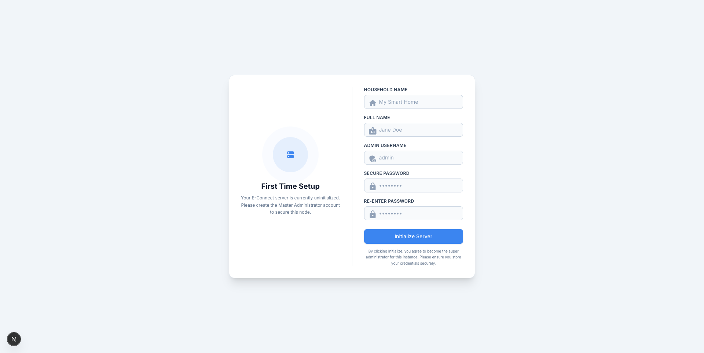
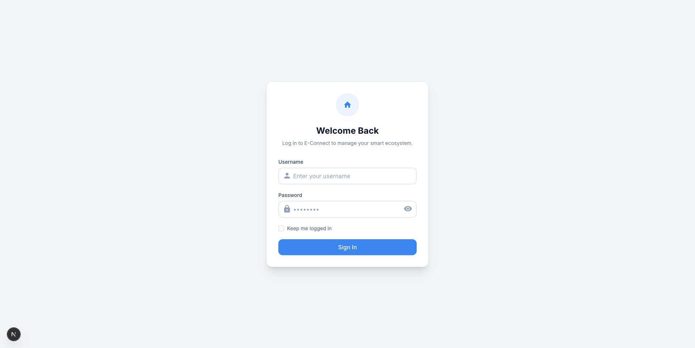
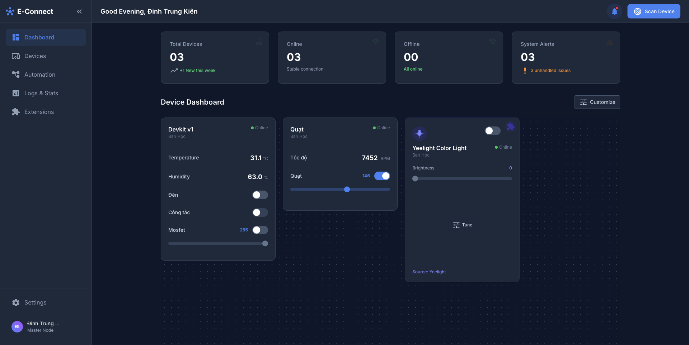
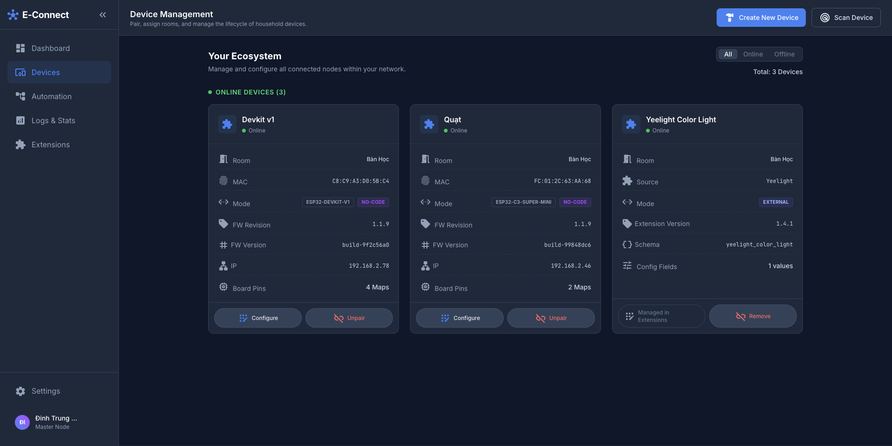
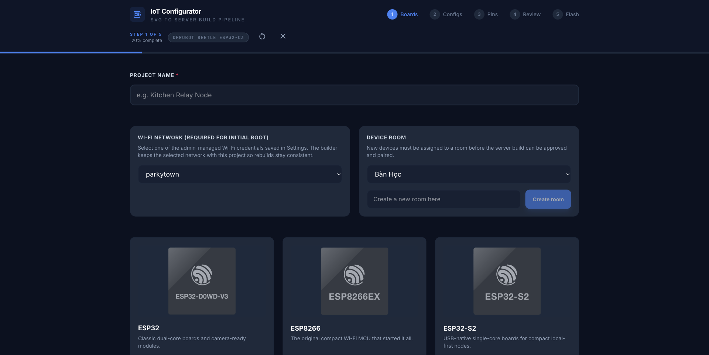
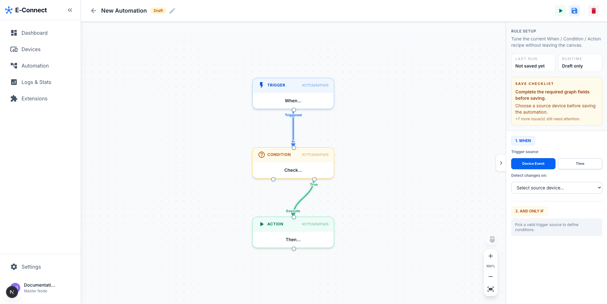
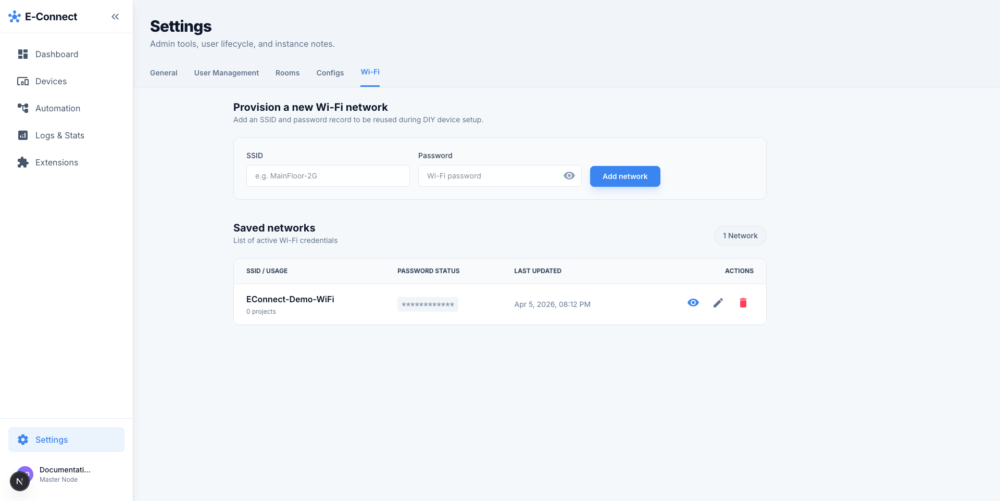

# E-Connect

> Self-hosted, local-first smart home control for LAN devices, MQTT workflows, and DIY ESP32/ESP8266 provisioning.

[Tiếng Việt](#tiếng-việt) • [English](#english)

---

## Tour Giao Diện / Visual Tour

### 1. First-Time Setup


Tiếng Việt: Màn hình khởi tạo lần đầu dùng để tạo `Master Administrator`, khóa instance, và hoàn tất bootstrap an toàn cho hệ thống self-hosted.

English: The first-time setup screen creates the `Master Administrator`, locks the instance bootstrap flow, and secures the self-hosted installation.

### 2. Login


Tiếng Việt: Sau khi khởi tạo, người dùng đăng nhập qua form xác thực thật với tùy chọn `Keep me logged in`.

English: After bootstrap, users sign in through the real authentication flow with an optional `Keep me logged in` session mode.

### 3. Dashboard


Tiếng Việt: Dashboard là trung tâm quan sát thiết bị, cảnh báo hệ thống, trạng thái online/offline và các thao tác vận hành chính.

English: The dashboard is the command surface for device status, system alerts, online/offline visibility, and day-to-day operations.

### 4. Device Management


Tiếng Việt: Khu vực `Devices` quản lý vòng đời thiết bị, duyệt thiết bị mới, và đi vào luồng cấu hình DIY qua SVG builder.

English: The `Devices` area manages the device lifecycle, approves new devices, and launches the DIY SVG-based provisioning flow.

### 5. DIY Builder


Tiếng Việt: `IoT Configurator` hỗ trợ chọn board ESP32/ESP8266, gắn Wi-Fi đã lưu, chọn profile phần cứng, map GPIO và chuẩn bị build firmware phía server.

English: The `IoT Configurator` lets you choose ESP32/ESP8266 boards, attach saved Wi-Fi credentials, pick hardware profiles, map GPIO, and prepare server-side firmware builds.

### 6. Automation Builder


Tiếng Việt: Trình tạo automation dùng graph builder trực quan theo mô hình `Trigger -> Condition -> Action`, có workspace riêng để lưu, chạy thử và kiểm tra rule.

English: The automation builder uses a visual `Trigger -> Condition -> Action` graph workspace for saving, testing, and iterating automation rules.

### 7. Settings And Wi-Fi Credentials


Tiếng Việt: `Settings` tập trung phần quản trị instance như timezone, user management, rooms, DIY configs, và danh sách Wi-Fi dùng lại cho provisioning.

English: `Settings` centralizes instance administration, including timezone, user management, rooms, DIY configs, and reusable Wi-Fi credentials for provisioning.

---

## Tiếng Việt

### Giới thiệu

**E-Connect** là nền tảng smart home `self-hosted`, `local-first`, tập trung vào:

- điều khiển thiết bị trong mạng LAN
- quản lý vòng đời thiết bị DIY dùng `ESP32` và `ESP8266`
- giao tiếp ưu tiên `MQTT`
- dashboard điều khiển và giám sát trạng thái
- build firmware phía server, flash qua trình duyệt và mapping GPIO bằng giao diện trực quan
- automation dạng graph builder
- lưu trạng thái bền vững trên hạ tầng của chính người dùng

### Điểm nổi bật

- **Local-first thật sự**: phần điều khiển cốt lõi vẫn hoạt động trong LAN ngay cả khi Internet không ổn định.
- **Self-hosted gọn**: stack người dùng chỉ gồm `db`, `mqtt`, `server`, `webapp`.
- **DIY-friendly**: có board picker, lưu Wi-Fi tập trung, pin mapping, build firmware, và đường dẫn flash.
- **Quản trị tập trung**: dashboard, logs, settings, automation, extensions đều nằm trong cùng giao diện.

### Kiến trúc self-hosted

| Thành phần | Vai trò |
|---|---|
| `server` | FastAPI backend cho auth, API, build firmware, WebSocket, automation, device lifecycle |
| `webapp` | Next.js 16 + React 19 frontend cho setup, dashboard, devices, automation, settings |
| `mqtt` | Mosquitto broker cho command/state loop |
| `db` | MariaDB lưu user, household, device, config, automation, log |

### Chạy Nhanh Theo Kiểu Copy & Run

Không cần tạo `.env` cho cấu hình mặc định. Chỉ cần copy file `docker-compose.user.yml` của repo này vào một thư mục trống rồi chạy:

```bash
mkdir econnect && cd econnect
docker compose -f docker-compose.user.yml up -d
```

Nếu bạn muốn tải file trực tiếp thay vì copy tay:

```bash
mkdir econnect && cd econnect
curl -fsSLO https://raw.githubusercontent.com/isharoverwhite/Final-Project/main/docker-compose.user.yml
docker compose -f docker-compose.user.yml up -d
```

Sau khi stack lên xong:

1. Trên máy đang chạy Docker, mở `https://localhost:3443`
2. Hoàn tất `First Time Setup`
3. Đăng nhập bằng tài khoản admin vừa tạo
4. Vào `Settings -> Wi-Fi` để lưu mạng Wi-Fi dùng cho provisioning
5. Vào `Devices -> Create New Device` để tạo project DIY đầu tiên

### Truy cập từ thiết bị khác trong LAN

Đây là phần quan trọng nhất để mở đúng WebUI qua HTTPS:

1. Nếu bạn chỉ dùng trên chính máy chạy Docker, giữ mặc định và mở `https://localhost:3443`
2. Nếu bạn muốn mở từ điện thoại hoặc máy khác trong LAN, nên tạo file `.env` trước khi `docker compose up -d` và khai báo host mà certificate HTTPS phải bao phủ
3. Cách ổn nhất khi truy cập bằng IP là thêm `HTTPS_IPS=<LAN_IP_CUA_SERVER>`
4. Nếu bạn có hostname nội bộ như `econnect.local`, thêm nó vào `HTTPS_HOSTS`

Ví dụ:

```env
HTTPS_HOSTS=localhost,econnect.local,e-connect.local
HTTPS_IPS=192.168.1.25
```

Sau đó mở WebUI bằng đúng host đã khai báo trong cert:

- `https://192.168.1.25:3443`
- hoặc `https://econnect.local:3443`

Nếu bạn đổi IP hoặc hostname sau lần chạy đầu tiên, hãy dừng stack, xóa volume kết thúc bằng `_webapp_tls`, rồi chạy lại để certificate được tạo mới:

```bash
docker compose -f docker-compose.user.yml down
docker volume ls | grep webapp_tls
docker volume rm <your_project>_webapp_tls
docker compose -f docker-compose.user.yml up -d
```

### Luồng sử dụng đề xuất

1. **Bootstrap hệ thống**
   Mở `https://localhost:3443` hoặc host HTTPS bạn đã cấu hình, hoàn tất `First Time Setup`, rồi đăng nhập bằng tài khoản admin vừa tạo.

2. **Lưu mạng Wi-Fi dùng chung**
   Vào `Settings -> Wi-Fi`, thêm SSID và mật khẩu mà thiết bị DIY sẽ dùng khi khởi động lần đầu.

3. **Tạo cấu hình phần cứng**
   Vào `Devices -> Create New Device`, chọn board, profile phần cứng, room, và network đã lưu.

4. **Map GPIO và build firmware**
   Đi tiếp qua các bước `Configs -> Pins -> Review -> Flash` để tạo build phía server.

5. **Onboard và quản lý thiết bị**
   Dùng các màn hình `Dashboard` hoặc `Devices` để quét, duyệt, và quản lý thiết bị mới trong cùng WebUI.

6. **Tạo automation**
   Vào `Automation`, dựng rule theo sơ đồ `Trigger -> Condition -> Action`.

### Biến tùy chỉnh tùy chọn

Mặc định đã chạy được ngay. Chỉ tạo `.env` nếu bạn muốn override:

```env
TZ=Asia/Ho_Chi_Minh
DB_ROOT_PASSWORD=your_root_password
DB_PASSWORD=your_app_password
SECRET_KEY=your_secret_key
HTTPS_HOSTS=localhost,econnect.local,e-connect.local
HTTPS_IPS=192.168.1.25
ECONNECT_SERVER_IMAGE=docker.io/ryzen30xx/econnect-server:latest
ECONNECT_WEBAPP_IMAGE=docker.io/ryzen30xx/econnect-webapp:latest
ECONNECT_MQTT_IMAGE=docker.io/ryzen30xx/econnect-mqtt:latest
```

### Build từ source

Nếu bạn muốn chạy trực tiếp từ mã nguồn thay vì image public:

```bash
git clone https://github.com/isharoverwhite/Final-Project.git
cd Final-Project
docker compose up -d --build db mqtt server webapp
```

Sau đó truy cập `https://localhost:3443`.

### Ghi chú triển khai

- `docker-compose.user.yml` đã được cấu hình sẵn image mặc định từ Docker Hub và không yêu cầu khai báo image bằng tay.
- Cổng HTTPS chính cho WebUI là `3443`.
- Lần đầu mở WebUI trên một máy mới, trình duyệt có thể cảnh báo certificate tự ký. Bạn chỉ cần chấp nhận certificate đó cho host nội bộ mà bạn đang dùng.

### License

Mã nguồn và tài sản của repository hiện được phân phối dưới giấy phép proprietary trong [`LICENSE`](./LICENSE). Tham khảo thêm [`REPOSITORY_PROTECTION.md`](./REPOSITORY_PROTECTION.md) cho ghi chú bảo vệ repository và nội dung pháp lý liên quan.

---

## English

### Overview

**E-Connect** is a `self-hosted`, `local-first` smart home platform focused on:

- LAN-native device control
- DIY ESP32 / ESP8266 onboarding
- MQTT-first messaging
- dashboard-driven operations
- server-side firmware builds, browser flashing, and visual GPIO mapping
- visual automations
- durable state stored on user-owned infrastructure

### Highlights

- **Real local-first behavior**: core control stays on the LAN.
- **Compact self-hosted stack**: end users run only `db`, `mqtt`, `server`, and `webapp`.
- **DIY provisioning flow**: board selection, saved Wi-Fi credentials, pin mapping, server builds, and flash-ready workflows.
- **Single admin surface**: dashboard, logs, settings, devices, automation, and extensions live in one product.

### Self-hosted architecture

| Component | Responsibility |
|---|---|
| `server` | FastAPI backend for auth, APIs, firmware builds, WebSockets, automation, and device lifecycle |
| `webapp` | Next.js 16 + React 19 frontend for setup, dashboard, devices, automation, and settings |
| `mqtt` | Mosquitto broker for command/state transport |
| `db` | MariaDB for users, households, devices, configs, automations, and logs |

### Copy And Run Quick Start

No `.env` file is required for the default setup. Copy `docker-compose.user.yml` from this repository into an empty folder, then run:

```bash
mkdir econnect && cd econnect
docker compose -f docker-compose.user.yml up -d
```

If you prefer fetching the file directly instead of copying it manually:

```bash
mkdir econnect && cd econnect
curl -fsSLO https://raw.githubusercontent.com/isharoverwhite/Final-Project/main/docker-compose.user.yml
docker compose -f docker-compose.user.yml up -d
```

When the stack is ready:

1. On the Docker host machine, open `https://localhost:3443`
2. Complete `First Time Setup`
3. Sign in with the new admin account
4. Save at least one Wi-Fi credential in `Settings -> Wi-Fi`
5. Open `Devices -> Create New Device` and start your first DIY project

### Access From Another LAN Device

This is the important part if you want HTTPS to work correctly beyond the Docker host:

1. If you only use the WebUI on the Docker host itself, keep the defaults and open `https://localhost:3443`
2. If you want to open the WebUI from another phone or computer on the LAN, create a local `.env` before `docker compose up -d` and declare the hostnames or IPs that the HTTPS certificate must cover
3. The most reliable IP-based setup is `HTTPS_IPS=<YOUR_SERVER_LAN_IP>`
4. If you use an internal hostname such as `econnect.local`, add it to `HTTPS_HOSTS`

Example:

```env
HTTPS_HOSTS=localhost,econnect.local,e-connect.local
HTTPS_IPS=192.168.1.25
```

Then open the WebUI with the same host covered by the certificate:

- `https://192.168.1.25:3443`
- or `https://econnect.local:3443`

If you change the IP or hostname after the first run, stop the stack, remove the volume ending in `_webapp_tls`, and start again so the certificate can be regenerated:

```bash
docker compose -f docker-compose.user.yml down
docker volume ls | grep webapp_tls
docker volume rm <your_project>_webapp_tls
docker compose -f docker-compose.user.yml up -d
```

### Recommended Usage Flow

1. **Bootstrap the instance**
   Open `https://localhost:3443` or your configured HTTPS host, complete the first-time setup flow, and sign in with the new admin account.

2. **Store reusable Wi-Fi credentials**
   Go to `Settings -> Wi-Fi` and save the network your DIY nodes should use during initial boot.

3. **Create a hardware project**
   Open `Devices -> Create New Device`, then choose the board family, exact profile, room, and saved network.

4. **Map GPIO and build firmware**
   Continue through `Configs -> Pins -> Review -> Flash` to prepare a server-generated firmware build.

5. **Onboard and manage devices**
   Use the `Dashboard` or `Devices` screens to scan, approve, and manage devices directly in the WebUI.

6. **Build automations**
   Open `Automation` and compose rules through the visual `Trigger -> Condition -> Action` graph builder.

### Optional Overrides

The default file already works. Create a local `.env` only if you want custom values:

```env
TZ=Asia/Ho_Chi_Minh
DB_ROOT_PASSWORD=your_root_password
DB_PASSWORD=your_app_password
SECRET_KEY=your_secret_key
HTTPS_HOSTS=localhost,econnect.local,e-connect.local
HTTPS_IPS=192.168.1.25
ECONNECT_SERVER_IMAGE=docker.io/ryzen30xx/econnect-server:latest
ECONNECT_WEBAPP_IMAGE=docker.io/ryzen30xx/econnect-webapp:latest
ECONNECT_MQTT_IMAGE=docker.io/ryzen30xx/econnect-mqtt:latest
```

### Run From Source

If you want to build directly from the repository instead of the published Docker Hub images:

```bash
git clone https://github.com/isharoverwhite/Final-Project.git
cd Final-Project
docker compose up -d --build db mqtt server webapp
```

Then open `https://localhost:3443`.

### Deployment Notes

- `docker-compose.user.yml` ships with working Docker Hub defaults and does not require manual image configuration.
- The primary HTTPS WebUI entrypoint is `:3443`.
- On first access from a new device, the browser may warn about the self-signed certificate. Accept it for the exact internal host you chose for the WebUI.

### License

This repository is distributed under the proprietary terms in [`LICENSE`](./LICENSE). See [`REPOSITORY_PROTECTION.md`](./REPOSITORY_PROTECTION.md) for repository-protection and legal notes.
