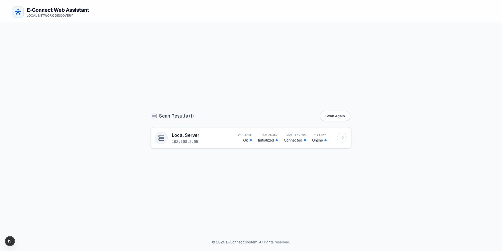

# E-Connect

> Self-hosted, local-first smart home control for LAN devices, MQTT workflows, and DIY ESP32/ESP8266 provisioning.

[Tiếng Việt](#tiếng-việt) • [English](#english)

---

## Tour Giao Diện / Visual Tour

### 1. Web Assistant


Tiếng Việt: `E-Connect Web Assistant` là cổng discovery giúp người dùng dò instance E-Connect trong cùng mạng LAN và kiểm tra nhanh trạng thái `Database`, `MQTT`, `Initialized`, `Web App`.

English: `E-Connect Web Assistant` is the discovery entrypoint that scans the local LAN, then shows `Database`, `MQTT`, `Initialized`, and `Web App` status for each detected server.

### 2. First-Time Setup


Tiếng Việt: Màn hình khởi tạo lần đầu dùng để tạo `Master Administrator`, khóa instance, và hoàn tất bootstrap an toàn cho hệ thống self-hosted.

English: The first-time setup screen creates the `Master Administrator`, locks the instance bootstrap flow, and secures the self-hosted installation.

### 3. Login


Tiếng Việt: Sau khi khởi tạo, người dùng đăng nhập qua form xác thực thật với tùy chọn `Keep me logged in`.

English: After bootstrap, users sign in through the real authentication flow with an optional `Keep me logged in` session mode.

### 4. Dashboard


Tiếng Việt: Dashboard là trung tâm quan sát thiết bị, cảnh báo hệ thống, trạng thái online/offline và điểm bắt đầu cho các thao tác scan hoặc tùy biến bố cục.

English: The dashboard is the command surface for device status, system alerts, online/offline visibility, and quick access to scanning or layout customization.

### 5. Device Management


Tiếng Việt: Khu vực `Devices` quản lý vòng đời thiết bị, scan node mới, và đi vào luồng cấu hình DIY qua SVG builder.

English: The `Devices` area manages the device lifecycle, scans for new nodes, and launches the DIY SVG-based provisioning flow.

### 6. DIY Builder


Tiếng Việt: `IoT Configurator` hỗ trợ chọn board ESP32/ESP8266, gắn Wi-Fi đã lưu, chọn profile phần cứng, map GPIO và chuẩn bị build firmware phía server.

English: The `IoT Configurator` lets you choose ESP32/ESP8266 boards, attach saved Wi-Fi credentials, pick hardware profiles, map GPIO, and prepare server-side firmware builds.

### 7. Automation Builder


Tiếng Việt: Trình tạo automation dùng graph builder trực quan theo mô hình `Trigger -> Condition -> Action`, có workspace riêng để lưu, chạy thử và kiểm tra rule.

English: The automation builder uses a visual `Trigger -> Condition -> Action` graph workspace for saving, testing, and iterating automation rules.

### 8. Settings And Wi-Fi Credentials


Tiếng Việt: `Settings` tập trung phần quản trị instance như timezone, user management, rooms, DIY configs, và danh sách Wi-Fi dùng lại cho provisioning.

English: `Settings` centralizes instance administration, including timezone, user management, rooms, DIY configs, and reusable Wi-Fi credentials for provisioning.

---

## Tiếng Việt

### Giới thiệu

**E-Connect** là nền tảng smart home `self-hosted`, `local-first`, tập trung vào:

- điều khiển thiết bị trong mạng LAN
- quản lý vòng đời thiết bị DIY dùng `ESP32` và `ESP8266`
- giao tiếp ưu tiên `MQTT`
- dashboard điều khiển và giám sát trạng thái
- build firmware phía server, flash qua trình duyệt và mapping GPIO bằng giao diện trực quan
- automation dạng graph builder
- lưu trạng thái bền vững trên hạ tầng của chính người dùng

### Điểm nổi bật

- **Local-first thật sự**: phần điều khiển cốt lõi vẫn hoạt động trong LAN ngay cả khi Internet không ổn định.
- **Self-hosted gọn**: stack người dùng chỉ gồm `db`, `mqtt`, `server`, `webapp`.
- **Discovery tách biệt rõ**: `find_website` là cổng public do chủ dự án vận hành, không chạy trên home server của người dùng.
- **DIY-friendly**: có board picker, lưu Wi-Fi tập trung, pin mapping, build firmware, và đường dẫn flash.
- **Quản trị tập trung**: dashboard, logs, settings, automation, extensions đều nằm trong cùng giao diện.

### Kiến trúc

| Thành phần | Vai trò |
|---|---|
| `server` | FastAPI backend cho auth, API, build firmware, WebSocket, automation, device lifecycle |
| `webapp` | Next.js 16 + React 19 frontend cho setup, dashboard, devices, automation, settings |
| `mqtt` | Mosquitto broker cho command/state loop |
| `db` | MariaDB lưu user, household, device, config, automation, log |
| `find_website` | Public discovery portal giúp trình duyệt người dùng dò server trong LAN |

### Chạy Nhanh Theo Kiểu Copy & Run

Không cần tạo `.env` cho cấu hình mặc định. Chỉ cần copy file `docker-compose.user.yml` của repo này vào một thư mục trống rồi chạy:

```bash
mkdir econnect && cd econnect
docker compose -f docker-compose.user.yml up -d
```

Nếu bạn muốn tải file trực tiếp thay vì copy tay:

```bash
mkdir econnect && cd econnect
curl -fsSLO https://raw.githubusercontent.com/isharoverwhite/Final-Project/main/docker-compose.user.yml
docker compose -f docker-compose.user.yml up -d
```

Sau khi stack lên xong:

1. Mở `https://localhost:3443`
2. Tạo tài khoản `Master Administrator`
3. Vào `Settings -> Wi-Fi` để lưu mạng Wi-Fi dùng cho provisioning
4. Vào `Devices -> Create New Device` để tạo project DIY đầu tiên
5. Từ một thiết bị khác cùng LAN, mở [find.isharoverwhite.com](https://find.isharoverwhite.com) để dò instance E-Connect

### Luồng Sử Dụng Đề Xuất

1. **Bootstrap hệ thống**
   Mở `https://localhost:3443`, hoàn tất `First Time Setup`, rồi đăng nhập bằng tài khoản admin vừa tạo.

2. **Lưu mạng Wi-Fi dùng chung**
   Vào `Settings -> Wi-Fi`, thêm SSID và mật khẩu mà thiết bị DIY sẽ dùng khi khởi động lần đầu.

3. **Tạo cấu hình phần cứng**
   Vào `Devices -> Create New Device`, chọn board, profile phần cứng, room, và network đã lưu.

4. **Map GPIO và build firmware**
   Đi tiếp qua các bước `Configs -> Pins -> Review -> Flash` để tạo build phía server.

5. **Onboard và quản lý thiết bị**
   Dùng `Scan Device` hoặc public finder để dò node mới, approve thiết bị và đưa vào dashboard.

6. **Tạo automation**
   Vào `Automation`, dựng rule theo sơ đồ `Trigger -> Condition -> Action`.

### Biến Tùy Chỉnh Tùy Chọn

Mặc định đã chạy được ngay. Chỉ tạo `.env` nếu bạn muốn override:

```env
TZ=Asia/Ho_Chi_Minh
DB_ROOT_PASSWORD=your_root_password
DB_PASSWORD=your_app_password
SECRET_KEY=your_secret_key
ECONNECT_SERVER_IMAGE=docker.io/ryzen30xx/econnect-server:latest
ECONNECT_WEBAPP_IMAGE=docker.io/ryzen30xx/econnect-webapp:latest
ECONNECT_MQTT_IMAGE=docker.io/ryzen30xx/econnect-mqtt:latest
```

### Build Từ Source

Nếu bạn muốn chạy trực tiếp từ mã nguồn thay vì image public:

```bash
git clone https://github.com/isharoverwhite/Final-Project.git
cd Final-Project
docker compose up -d --build db mqtt server webapp
```

Sau đó truy cập `https://localhost:3443`.

### Ghi Chú Triển Khai

- `docker-compose.user.yml` đã được cấu hình sẵn image mặc định từ Docker Hub và không yêu cầu khai báo image bằng tay.
- `find_website` không nằm trong stack self-hosted mặc định.
- Cổng HTTPS chính cho Web UI là `3443`, vì vậy tài liệu và luồng người dùng nên bắt đầu từ `https://localhost:3443`.

### License

Mã nguồn và tài sản của repository hiện được phân phối dưới giấy phép proprietary trong [`LICENSE`](./LICENSE). Tham khảo thêm [`REPOSITORY_PROTECTION.md`](./REPOSITORY_PROTECTION.md) cho ghi chú bảo vệ repository và nội dung pháp lý liên quan.

---

## English

### Overview

**E-Connect** is a `self-hosted`, `local-first` smart home platform focused on:

- LAN-native device control
- DIY ESP32 / ESP8266 onboarding
- MQTT-first messaging
- dashboard-driven operations
- server-side firmware builds, browser flashing, and visual GPIO mapping
- visual automations
- durable state stored on user-owned infrastructure

### Highlights

- **Real local-first behavior**: core control stays on the LAN.
- **Compact self-hosted stack**: end users run only `db`, `mqtt`, `server`, and `webapp`.
- **Separated discovery topology**: `find_website` remains a developer-hosted public entrypoint and is not deployed on the user's home server.
- **DIY provisioning flow**: board selection, saved Wi-Fi credentials, pin mapping, server builds, and flash-ready workflows.
- **Single admin surface**: dashboard, logs, settings, devices, automation, and extensions live in one product.

### Architecture

| Component | Responsibility |
|---|---|
| `server` | FastAPI backend for auth, APIs, firmware builds, WebSockets, automation, and device lifecycle |
| `webapp` | Next.js 16 + React 19 frontend for setup, dashboard, devices, automation, and settings |
| `mqtt` | Mosquitto broker for command/state transport |
| `db` | MariaDB for users, households, devices, configs, automations, and logs |
| `find_website` | Public discovery portal that helps browsers locate a local E-Connect server on the LAN |

### Copy And Run Quick Start

No `.env` file is required for the default setup. Copy `docker-compose.user.yml` from this repository into an empty folder, then run:

```bash
mkdir econnect && cd econnect
docker compose -f docker-compose.user.yml up -d
```

If you prefer fetching the file directly instead of copying it manually:

```bash
mkdir econnect && cd econnect
curl -fsSLO https://raw.githubusercontent.com/isharoverwhite/Final-Project/main/docker-compose.user.yml
docker compose -f docker-compose.user.yml up -d
```

When the stack is ready:

1. Open `https://localhost:3443`
2. Create the `Master Administrator`
3. Save at least one Wi-Fi credential in `Settings -> Wi-Fi`
4. Open `Devices -> Create New Device` and start your first DIY project
5. From another device on the same LAN, open [find.isharoverwhite.com](https://find.isharoverwhite.com) to discover the local instance

### Recommended Usage Flow

1. **Bootstrap the instance**
   Open `https://localhost:3443`, complete the first-time setup flow, and sign in with the new admin account.

2. **Store reusable Wi-Fi credentials**
   Go to `Settings -> Wi-Fi` and save the network your DIY nodes should use during initial boot.

3. **Create a hardware project**
   Open `Devices -> Create New Device`, then choose the board family, exact profile, room, and saved network.

4. **Map GPIO and build firmware**
   Continue through `Configs -> Pins -> Review -> Flash` to prepare a server-generated firmware build.

5. **Onboard and manage devices**
   Use `Scan Device` or the public finder to discover new nodes, approve them, and move them into the dashboard.

6. **Build automations**
   Open `Automation` and compose rules through the visual `Trigger -> Condition -> Action` graph builder.

### Optional Overrides

The default file already works. Create a local `.env` only if you want custom values:

```env
TZ=Asia/Ho_Chi_Minh
DB_ROOT_PASSWORD=your_root_password
DB_PASSWORD=your_app_password
SECRET_KEY=your_secret_key
ECONNECT_SERVER_IMAGE=docker.io/ryzen30xx/econnect-server:latest
ECONNECT_WEBAPP_IMAGE=docker.io/ryzen30xx/econnect-webapp:latest
ECONNECT_MQTT_IMAGE=docker.io/ryzen30xx/econnect-mqtt:latest
```

### Run From Source

If you want to build directly from the repository instead of the published Docker Hub images:

```bash
git clone https://github.com/isharoverwhite/Final-Project.git
cd Final-Project
docker compose up -d --build db mqtt server webapp
```

Then open `https://localhost:3443`.

### Deployment Notes

- `docker-compose.user.yml` now ships with working Docker Hub defaults and does not require manual image configuration.
- `find_website` is intentionally excluded from the default self-hosted stack.
- The primary user-facing Web UI entrypoint is `https://localhost:3443`.

### License

This repository is distributed under the proprietary terms in [`LICENSE`](./LICENSE). See [`REPOSITORY_PROTECTION.md`](./REPOSITORY_PROTECTION.md) for repository-protection and legal notes.
