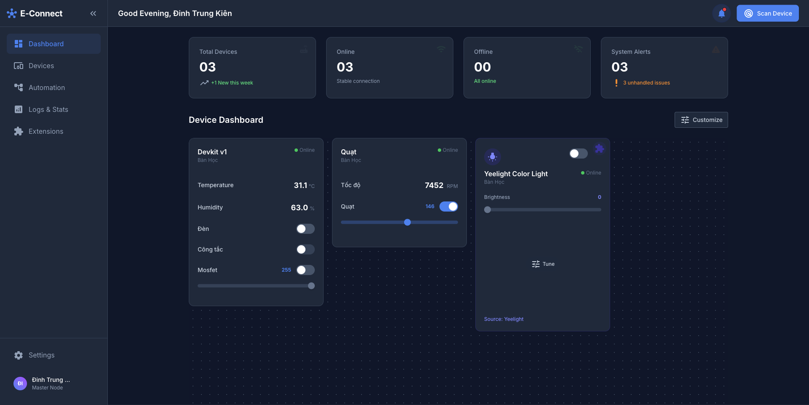
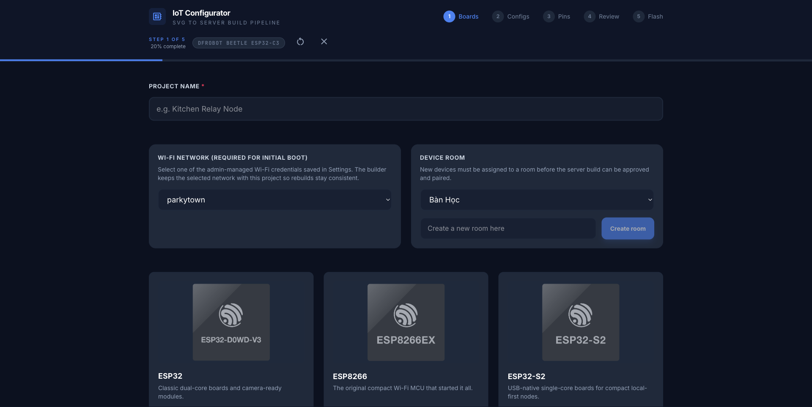
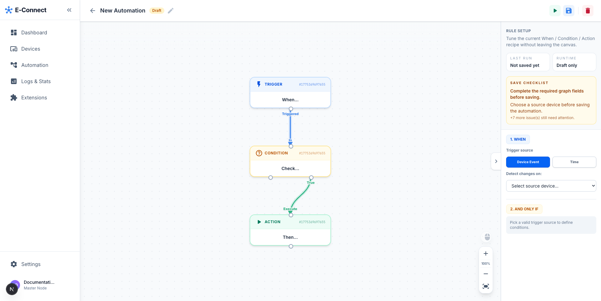
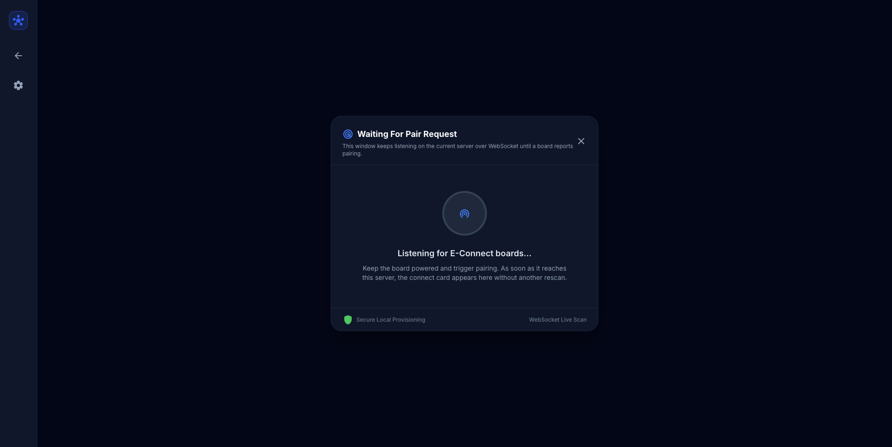
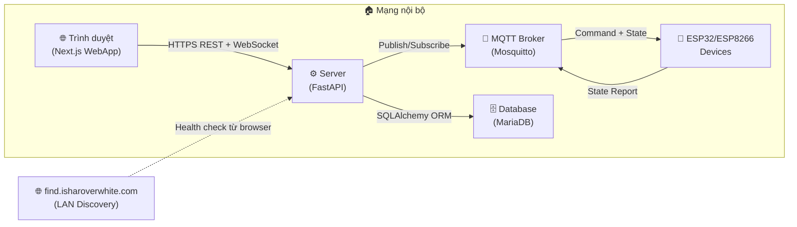
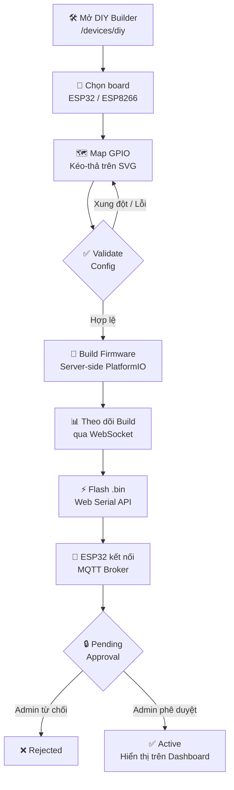
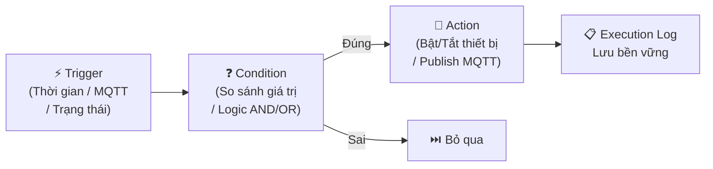
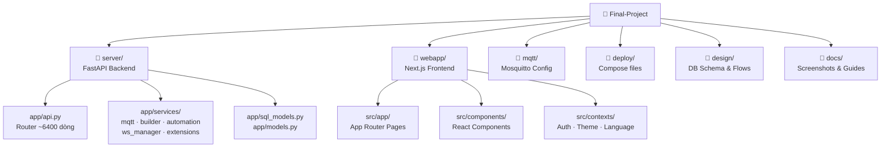

<p align="center">
  
  
  
  
  
</p>

<h1 align="center">🏠 E-Connect</h1>
<h3 align="center">Nền tảng Smart Home tự host — hoàn toàn cục bộ, không phụ thuộc cloud</h3>

<p align="center">
  <strong>Xây dựng, quản lý và tự động hóa hệ thống nhà thông minh ngay trong mạng LAN của bạn.</strong>
</p>

<p align="center">
  <a href="#-giới-thiệu">Giới thiệu</a> •
  <a href="#-tính-năng-chính">Tính năng</a> •
  <a href="#-giao-diện">Giao diện</a> •
  <a href="#-kiến-trúc">Kiến trúc</a> •
  <a href="#-cài-đặt">Cài đặt</a> •
  <a href="#-quy-trình-sử-dụng">Quy trình</a> •
  <a href="#-công-nghệ">Công nghệ</a> •
  <a href="#-roadmap">Roadmap</a>
</p>

---

## 📖 Giới thiệu

**E-Connect** là nền tảng smart home **self-hosted, local-first** cho phép bạn xây dựng và vận hành toàn bộ hệ thống IoT trong mạng nội bộ — không cần Internet, không cần tài khoản đám mây, không bị phụ thuộc vào bên thứ ba.

> 💡 **Triết lý cốt lõi:** Dữ liệu và quyền kiểm soát nhà bạn luôn nằm trong tay bạn. Mất Internet không làm tê liệt hệ thống.

Từ việc lập trình firmware ESP32 trực tiếp trên trình duyệt, tạo automation theo sơ đồ quy tắc trực quan, đến quản lý tập trung tất cả thiết bị theo khu vực — E-Connect cung cấp một giải pháp hoàn chỉnh, bảo mật và có thể mở rộng cho ngôi nhà thông minh thế hệ mới.

<br>

## ❌ Vấn đề & ✅ Giải pháp

<table>
<tr>
<td width="50%">

**❌ Trước khi có E-Connect**

- Phụ thuộc vào cloud của nhà sản xuất — nếu họ tắt dịch vụ, thiết bị trở nên vô dụng
- Dữ liệu nhà bạn lưu trên server nước ngoài, không kiểm soát được quyền riêng tư
- Flash firmware ESP32 đòi hỏi cài đặt toolchain phức tạp trên máy tính
- Automation chỉ hỗ trợ các kịch bản đơn giản, không có điều kiện phức tạp
- Phải nhập lại mật khẩu Wi-Fi mỗi khi thêm thiết bị mới
- Không có cơ chế kiểm soát thiết bị lạ kết nối vào hệ thống

</td>
<td width="50%">

**✅ Với E-Connect**

- Toàn bộ dữ liệu và logic chạy trên phần cứng của bạn, ngay trong LAN
- Quyền riêng tư tuyệt đối — không có request nào rời khỏi mạng nội bộ
- Build và flash ESP32 firmware trực tiếp từ trình duyệt bằng Web Serial API
- Automation với visual rule graph Trigger → Condition → Action linh hoạt
- Lưu trữ tập trung Wi-Fi credentials, tái sử dụng khi thêm thiết bị mới
- Thiết bị mới luôn ở trạng thái `pending` — admin phải phê duyệt trước khi hoạt động

</td>
</tr>
</table>

<br>

## ✨ Tính năng chính

<table>
<tr>
<td width="50%">

**🔌 Quản lý thiết bị**
- Dashboard điều khiển thiết bị theo khu vực (area/room)
- Hiển thị trạng thái real-time qua MQTT + WebSocket
- Onboarding an toàn: thiết bị mới phải được admin phê duyệt
- Lịch sử trạng thái thiết bị có thể tra cứu

**🛠️ DIY Firmware Builder**
- Kéo-thả map GPIO trên SVG board trực quan
- Validate xung đột chân và capability tự động
- Build server-side bằng PlatformIO, không cần cài toolchain
- Flash `.bin` trực tiếp qua Web Serial API trên trình duyệt

**🔌 Extension System**
- Upload ZIP chứa Python hook + manifest
- Chạy trong sandbox, hỗ trợ thiết bị bên ngoài (Yeelight, v.v.)
- Cơ chế `validate_command` / `execute_command` / `probe_state`

</td>
<td width="50%">

**🤖 Automation Engine**
- Visual rule graph builder: Trigger → Condition → Action
- Trigger theo thời gian, sự kiện MQTT, trạng thái thiết bị
- Execution log đầy đủ, persistent

**🔒 Bảo mật & Quyền truy cập**
- JWT authentication với access + refresh token
- Role-based access: Admin và Member
- API key cho tích hợp programmatic
- Chỉ Admin mới tạo được tài khoản — không có self-registration

**📊 Giám sát hệ thống**
- Real-time CPU, RAM, disk qua WebSocket
- System logs có phân loại severity và category
- Serial monitor tích hợp cho debug firmware

**🌐 Khám phá LAN tự động**
- Truy cập [`find.isharoverwhite.com`](https://find.isharoverwhite.com) từ thiết bị cùng LAN để tìm server E-Connect của bạn tự động

</td>
</tr>
</table>

<br>

## 🖥️ Giao diện

<table>
<tr>
<td align="center" width="50%">

<sub><b>Dashboard</b> — Điều khiển thiết bị theo khu vực</sub>
</td>
<td align="center" width="50%">

<sub><b>DIY Builder</b> — Map GPIO và build firmware ngay trên trình duyệt</sub>
</td>
</tr>
<tr>
<td align="center" width="50%">

<sub><b>Automation Builder</b> — Tạo quy tắc tự động hóa trực quan</sub>
</td>
<td align="center" width="50%">

<sub><b>Device Discovery</b> — Phê duyệt thiết bị mới vào hệ thống</sub>
</td>
</tr>
</table>

<br>

## 🏗️ Kiến trúc


```mermaid
flowchart LR
    subgraph LAN["🏠 Mạng nội bộ"]
        Browser["🌐 Trình duyệt\n(Next.js WebApp)"]
        Server["⚙️ Server\n(FastAPI)"]
        MQTT["📡 MQTT Broker\n(Mosquitto)"]
        DB["🗄️ Database\n(MariaDB)"]
        ESP["🔌 ESP32/ESP8266\nDevices"]
    end

    External["🌐 find.isharoverwhite.com\n(LAN Discovery)"]

    Browser -->|HTTPS REST + WebSocket| Server
    Server -->|SQLAlchemy ORM| DB
    Server -->|Publish/Subscribe| MQTT
    MQTT -->|Command + State| ESP
    ESP -->|State Report| MQTT
    External -.->|Health check từ browser| Server
```

<br>

## 📦 Cài đặt

### Cách 1: Docker Compose — dành cho người dùng (Khuyến nghị)

```bash
# Tạo thư mục và tải file cấu hình
mkdir econnect && cd econnect
curl -fsSL https://raw.githubusercontent.com/isharoverwhite/Final-Project/main/deploy/user/compose.yml -o compose.yml

# (Tuỳ chọn) Chỉnh sửa mật khẩu, IP trong mục x-user-config
nano compose.yml

# Khởi động hệ thống
docker compose up -d
```

Truy cập giao diện tại `https://localhost:3443`. Lần đầu mở sẽ được hướng dẫn tạo tài khoản admin và household.

> 🔍 Dùng [`find.isharoverwhite.com`](https://find.isharoverwhite.com) từ thiết bị cùng LAN để tự động tìm địa chỉ server E-Connect của bạn.

---

### Cách 2: Build từ Source Code — dành cho developer

```bash
# Clone repository
git clone https://github.com/isharoverwhite/Final-Project.git
cd Final-Project

# Build và khởi động toàn bộ stack
docker compose up -d --build db mqtt server webapp

# Truy cập WebUI
# https://localhost:3443
```

---

### Cách 3: Chạy từng service riêng lẻ (development)

```bash
# Server (FastAPI)
cd server
pip install -r requirements.txt -r requirements-dev.txt
python -m uvicorn main:app --host 0.0.0.0 --port 8000 --reload

# Webapp (Next.js) — cổng HTTPS 3443
cd webapp
npm ci
npm run dev
```

<br>

## 🚀 Quy trình sử dụng

### Onboarding thiết bị DIY (ESP32/ESP8266)


```mermaid
flowchart TD
    A["🛠️ Mở DIY Builder\n/devices/diy"] --> B["🔌 Chọn board\nESP32 / ESP8266"]
    B --> C["🗺️ Map GPIO\nKéo-thả trên SVG"]
    C --> D{"✅ Validate\nConfig"}
    D -->|Xung đột / Lỗi| C
    D -->|Hợp lệ| E["🔨 Build Firmware\nServer-side PlatformIO"]
    E --> F["📊 Theo dõi Build\nqua WebSocket"]
    F --> G["⚡ Flash .bin\nWeb Serial API"]
    G --> H["📡 ESP32 kết nối\nMQTT Broker"]
    H --> I{"🔒 Pending\nApproval"}
    I -->|Admin từ chối| J["❌ Rejected"]
    I -->|Admin phê duyệt| K["✅ Active\nHiển thị trên Dashboard"]
```

### Tạo Automation


```mermaid
flowchart LR
    A["⚡ Trigger\n(Thời gian / MQTT\n/ Trạng thái)"] --> B["❓ Condition\n(So sánh giá trị\n/ Logic AND/OR)"]
    B -->|Đúng| C["🎯 Action\n(Bật/Tắt thiết bị\n/ Publish MQTT)"]
    B -->|Sai| D["⏭️ Bỏ qua"]
    C --> E["📋 Execution Log\nLưu bền vững"]
```

<br>

## 🗂️ Cấu trúc dự án


```mermaid
graph TD
    Root["📁 Final-Project"] --> Server["📁 server/\nFastAPI Backend"]
    Root --> Webapp["📁 webapp/\nNext.js Frontend"]
    Root --> MQTT["📁 mqtt/\nMosquitto Config"]
    Root --> Deploy["📁 deploy/\nCompose files"]
    Root --> Design["📁 design/\nDB Schema & Flows"]
    Root --> Docs["📁 docs/\nScreenshots & Guides"]

    Server --> API["app/api.py\nRouter ~6400 dòng"]
    Server --> Services["app/services/\nmqtt · builder · automation\nws_manager · extensions"]
    Server --> Models["app/sql_models.py\napp/models.py"]

    Webapp --> Pages["src/app/\nApp Router Pages"]
    Webapp --> Components["src/components/\nReact Components"]
    Webapp --> Contexts["src/contexts/\nAuth · Theme · Language"]
```

<br>

## 🔧 Công nghệ sử dụng

| Tầng | Công nghệ | Mục đích |
|------|-----------|----------|
| **Frontend** | Next.js 16, React 19, TypeScript | Giao diện người dùng, App Router |
| **Backend** | FastAPI, Python 3.11, SQLAlchemy | REST API, WebSocket, background tasks |
| **Database** | MariaDB 10.11 | Lưu trữ bền vững toàn bộ dữ liệu |
| **Messaging** | Eclipse Mosquitto 2, MQTT | Giao tiếp real-time với thiết bị IoT |
| **Auth** | python-jose, JWT | Access + Refresh token, Role-based access |
| **Build** | PlatformIO (server-side) | Biên dịch firmware Arduino cho ESP32/ESP8266 |
| **Flash** | Web Serial API (browser) | Flash firmware trực tiếp từ trình duyệt |
| **Container** | Docker, Docker Compose | Triển khai đồng nhất, dễ cài đặt |
| **Discovery** | Zeroconf/mDNS, SSDP | Tìm thiết bị trong LAN tự động |
| **Extension** | Python sandbox, ZIP manifest | Tích hợp thiết bị bên ngoài (Yeelight, v.v.) |

<br>

## ⚙️ Cấu hình

Chỉnh sửa mục `x-user-config` trong file `compose.yml`:

| Biến | Mô tả | Mặc định |
|------|--------|----------|
| `DB_PASSWORD` | Mật khẩu MariaDB | *(nên đặt lại)* |
| `JWT_SECRET` | Khoá bí mật ký JWT token | *(nên đặt lại)* |
| `SERVER_IP` | IP máy chủ trong LAN | `auto-detect` |
| `ALLOW_INSECURE_HTTP` | Bật HTTP không mã hóa | `0` (tắt) |
| `MQTT_HOST` | Địa chỉ MQTT broker | `mqtt` (container) |

> 🔒 **Lưu ý bảo mật:** Luôn đặt lại `DB_PASSWORD` và `JWT_SECRET` trước khi triển khai production.

<br>

## 🗺️ Roadmap

| Giai đoạn | Tính năng | Trạng thái |
|-----------|-----------|------------|
| **R1 (MVP)** | Dashboard · DIY Flasher · Automation · Extension System · Auth RBAC | ✅ Hoàn thành |
| **R2** | OTA fleet management · Advanced reporting · CSV/Excel export | 🔄 Đang phát triển |
| **R3** | Python extension sandbox đầy đủ · Zigbee production · Mobile app parity | 📋 Đã lên kế hoạch |
| **R4+** | HA master-slave topology · Voice assistant integration | 🔮 Dài hạn |

<br>

## 👥 Người dùng mục tiêu

- 🏠 **Người dùng cá nhân** muốn tự xây dựng hệ thống smart home mà không phụ thuộc cloud
- 🛠️ **Maker/Developer** muốn tích hợp ESP32/ESP8266 DIY vào nền tảng quản lý tập trung
- 🔒 **Người dùng ưu tiên quyền riêng tư** không muốn dữ liệu nhà mình lưu trên server nước ngoài
- 🏢 **Hộ gia đình nhiều thành viên** cần phân quyền và quản lý truy cập thiết bị

<br>

## 🤝 Đóng góp

Mọi đóng góp đều được chào đón! Bạn có thể:

- Tạo **Pull Request** để thêm tính năng hoặc sửa lỗi
- Tham khảo [Hướng dẫn phát triển Extension](./docs/EXTENSIONS.md) để tích hợp thiết bị mới
- Báo cáo lỗi qua **GitHub Issues**

Trước khi tạo PR, đảm bảo:
```bash
# Server: chạy toàn bộ test
cd server && pytest tests/ -v

# Webapp: lint và build
cd webapp && npm run lint && npm run build

# Kiểm tra copyright header
python3 scripts/repo_protection.py audit
```

<br>

---

<p align="center">
  <sub>🛠️ Được xây dựng với ❤️ để trao lại quyền kiểm soát ngôi nhà của bạn</sub>
  <br>
  <sub>© 2026 E-Connect • <a href="./LICENSE">MIT License</a> • <a href="https://find.isharoverwhite.com">find.isharoverwhite.com</a></sub>
</p>
