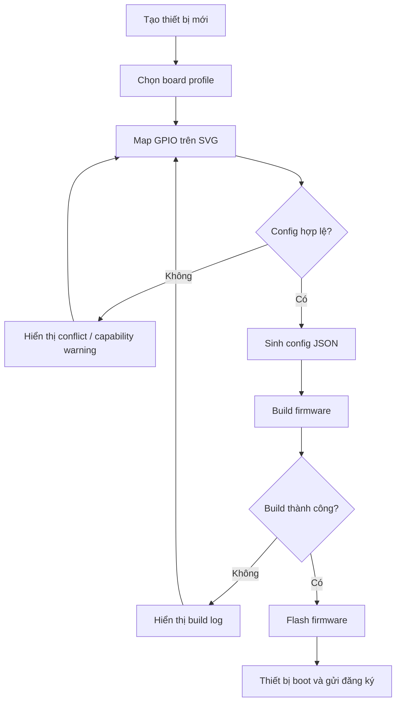

# E-Connect User Flow

**Trạng thái:** Draft v0.1  
**Nguồn tham chiếu chính:** [PRD.md](/Users/kiendinhtrung/Documents/Playground/PRD.md)  
**Mục tiêu tài liệu:** mô tả hành trình người dùng cốt lõi của E-Connect để làm nền cho thiết kế UX, chia màn hình, và ưu tiên implementation.

## Cách review tài liệu này

- Review theo từng `Flow 01`, `Flow 02`, ... thay vì sửa toàn bộ một lần.
- Nếu muốn chỉnh nhanh, chỉ cần nói rõ: `sửa Flow 03`, `thêm failure case cho Flow 05`, hoặc `đổi actor của Flow 01`.
- Các mục được gắn `MVP`, `Post-MVP`, `Long-term` để tránh trộn phạm vi release.

## 1. Product Intent Tóm Tắt

E-Connect là một nền tảng smart home self-hosted, local-first, tập trung vào:

- quản lý dashboard điều khiển thiết bị trong nhà
- onboarding và quản lý thiết bị DIY dùng ESP32/ESP8266
- automation chạy local
- local storage, offline operation, và reporting
- khả năng mở rộng qua MQTT, Zigbee, extension, OTA, và migration

Tài liệu này ưu tiên góc nhìn người dùng cuối, nhưng vẫn giữ các điểm chuyển trạng thái hệ thống quan trọng như:

- approval-based onboarding
- UUID-based device identity
- auto widget provisioning
- local-first và offline continuity

## 2. Actor Chính

### Actor A. Household Admin

Người cài đặt hệ thống, duyệt thiết bị mới, cấu hình dashboard, automation, firmware, role, và backup/restore.

### Actor B. Household Member

Người sử dụng dashboard hằng ngày để xem trạng thái và điều khiển các thiết bị đã được cấp quyền.

### Actor C. Advanced Maker

Người dùng nâng cao, cần serial debug, OTA, extension, hoặc khả năng migrate thiết bị khi thay board.

## 3. Bản Đồ Trải Nghiệm Tổng Quan

| Giai đoạn | Mục tiêu người dùng | Kết quả hệ thống mong đợi | Scope |
|---|---|---|---|
| Bắt đầu sử dụng | Truy cập hệ thống self-hosted và vào đúng household | Có phiên đăng nhập và quyền phù hợp | MVP |
| Tạo thiết bị DIY đầu tiên | Khai báo board, map GPIO, build, flash | Thiết bị sẵn sàng xin đăng ký | MVP |
| Duyệt thiết bị | Kiểm soát trust và cấp identity | Thiết bị được authorize và quản lý chính thức | MVP |
| Dùng dashboard | Điều khiển và giám sát thiết bị | Layout ổn định, control phản ánh capability thật | MVP |
| Tạo automation | Tự động hóa các hành vi local | Rule/script được lưu bền vững và chạy được | MVP |
| Theo dõi dữ liệu | Xem chart và export dữ liệu | Có lịch sử, chart, export từ UI | Post-MVP |
| Bảo trì thiết bị | Debug, OTA, restore, migrate | Thiết bị duy trì traceability và recoverability | Post-MVP / Long-term |

## 4. Flow 01: Truy Cập Hệ Thống Và Vào Household

**Mục tiêu:** người dùng vào được E-Connect với đúng role và đúng phạm vi quản lý.  
**Actor chính:** Household Admin, Household Member  
**Scope:** MVP

### Tiền điều kiện

- E-Connect đã được self-host trên mạng nội bộ.
- Household và tài khoản đã tồn tại hoặc đã được bootstrap trước đó.

### Luồng chính

1. Người dùng mở web app của E-Connect.
2. Hệ thống kiểm tra session hiện có.
3. Nếu chưa có session, người dùng đăng nhập.
4. Hệ thống xác thực người dùng và xác định household membership + role.
5. Người dùng được đưa vào dashboard hoặc màn hình gần nhất họ có quyền truy cập.
6. Navigation và action khả dụng được lọc theo role.

### Luồng ngoại lệ

- Nếu session hết hạn, hệ thống yêu cầu đăng nhập lại.
- Nếu người dùng không thuộc household nào, hệ thống hiển thị trạng thái chờ cấp quyền hoặc lỗi cấu hình.
- Nếu role không đủ quyền cho thao tác nhạy cảm, UI phải chặn rõ ràng thay vì để action thất bại âm thầm.

### Kết quả

- Người dùng nhìn thấy đúng dashboard và đúng nhóm tính năng theo role.
- Các thao tác nhạy cảm như duyệt device, flash, OTA, role management chỉ dành cho quyền phù hợp.

## 5. Flow 02: Tạo Thiết Bị DIY Đầu Tiên

**Mục tiêu:** người dùng tạo được một thiết bị DIY mà không cần viết code.  
**Actor chính:** Household Admin  
**Scope:** MVP

### Tiền điều kiện

- Người dùng có quyền quản lý thiết bị.
- Board profile mục tiêu đã được hệ thống hỗ trợ.
- Trình duyệt và môi trường host hỗ trợ build/flash theo phạm vi MVP.

### Luồng chính

1. Người dùng chọn `Tạo thiết bị DIY mới`.
2. Hệ thống yêu cầu nhập tên dự án thiết bị và chọn board profile.
3. Người dùng mở màn hình SVG pin mapping.
4. Người dùng gán chức năng cho từng GPIO như relay, switch, sensor, PWM, hoặc input.
5. Hệ thống kiểm tra:
   - pin conflict
   - pin reserved / boot-sensitive
   - capability mismatch
   - assignment thiếu bắt buộc
6. Nếu hợp lệ, hệ thống sinh config JSON của thiết bị.
7. Người dùng chọn `Build firmware`.
8. Hệ thống chạy build job và trả về trạng thái thành công/thất bại.
9. Nếu build thành công, người dùng chọn `Flash`.
10. Hệ thống khóa serial monitor nếu đang chiếm cùng cổng, rồi thực hiện flash.
11. Sau flash thành công, thiết bị khởi động, vào mạng, và gửi yêu cầu đăng ký về server.

### Luồng ngoại lệ

- Nếu chọn pin không hỗ trợ chức năng mong muốn, UI cảnh báo trước khi cho build.
- Nếu conflict GPIO, nút build phải bị chặn.
- Nếu build lỗi, hệ thống hiển thị log đủ để người dùng sửa cấu hình.
- Nếu flash thất bại, hệ thống giữ nguyên project/config để người dùng thử lại.
- Nếu serial terminal đang mở, hệ thống phải buộc pause hoặc đóng phiên serial trước khi flash.

### Kết quả

- Một DIY project hợp lệ được tạo.
- Thiết bị vật lý đã có firmware và bước tiếp theo là chờ approval.

## 6. Flow 03: Duyệt Thiết Bị Mới Và Kích Hoạt Quản Lý

**Mục tiêu:** mọi thiết bị mới phải được authorize rõ ràng trước khi tham gia hệ thống.  
**Actor chính:** Household Admin  
**Scope:** MVP

### Tiền điều kiện

- Thiết bị đã flash thành công hoặc một thiết bị library-based đã kết nối vào hệ thống.
- Server nhận được yêu cầu discovery/registration từ thiết bị.

### Luồng chính

1. Hệ thống phát hiện một thiết bị mới ở trạng thái `pending authorization`.
2. Admin nhận thông báo trong UI.
3. Admin mở chi tiết thiết bị để kiểm tra:
   - tên tạm thời
   - board/profile
   - fingerprint nhận diện hoặc UUID tạm
   - capability dự kiến
4. Admin chọn `Approve`.
5. Hệ thống gán hoặc xác nhận identity chính thức cho thiết bị.
6. Hệ thống lưu device registry, authorization status, và capability mapping.
7. Thiết bị chuyển sang trạng thái managed.
8. Dashboard control/widget phù hợp được auto-provision theo capability.
9. Thiết bị xuất hiện trong danh sách device và trên dashboard liên quan.

### Luồng ngoại lệ

- Nếu admin từ chối, thiết bị không được phép điều khiển hoặc ghi vào dashboard flow chính.
- Nếu thiết bị mất kết nối trong lúc chờ duyệt, trạng thái phải thể hiện rõ là `pending + offline`.
- Nếu capability thiết bị không khớp cấu hình project, hệ thống phải đánh dấu cần kiểm tra thay vì provision control sai.

### Kết quả

- Thiết bị có identity bền vững, được authorize, và bắt đầu tham gia dashboard/automation.

## 7. Flow 04: Dùng Dashboard Hằng Ngày

**Mục tiêu:** người dùng điều khiển và giám sát thiết bị từ một dashboard thống nhất.  
**Actor chính:** Household Member, Household Admin  
**Scope:** MVP

### Tiền điều kiện

- Dashboard đã tồn tại.
- Thiết bị và widget binding đã được cấu hình hoặc auto-provision.

### Luồng chính

1. Người dùng mở dashboard.
2. Hệ thống tải JSON layout và trạng thái thiết bị/sensor hiện tại.
3. Dashboard render các widget như switch, slider, gauge, chart, status.
4. Người dùng tương tác với widget.
5. Hệ thống gửi action đến device capability tương ứng qua lớp integration phù hợp.
6. Thiết bị phản hồi trạng thái mới.
7. Dashboard cập nhật lại UI gần thời gian thực.

### Luồng ngoại lệ

- Nếu thiết bị offline, widget phải hiện trạng thái disabled hoặc degraded rõ ràng.
- Nếu control thất bại, người dùng phải thấy lỗi hành động thay vì widget đổi trạng thái giả.
- Nếu Internet mất nhưng LAN vẫn còn, local dashboard và local control vẫn phải hoạt động.

### Kết quả

- Người dùng kiểm soát thiết bị thành công từ dashboard.
- Layout được render nhất quán trên web và client responsive.

## 8. Flow 05: Chỉnh Dashboard Builder

**Mục tiêu:** người dùng tùy biến dashboard mà không cần sửa JSON thủ công.  
**Actor chính:** Household Admin  
**Scope:** MVP

### Tiền điều kiện

- Người dùng có quyền chỉnh dashboard.
- Có danh sách widget/capability khả dụng.

### Luồng chính

1. Admin mở dashboard builder.
2. Admin kéo thả widget vào grid layout.
3. Admin cấu hình widget:
   - tên hiển thị
   - loại binding
   - device capability hoặc telemetry source
   - ngưỡng hiển thị nếu có
4. Hệ thống preview layout ngay trên UI.
5. Khi lưu, hệ thống tự sinh và persist JSON layout config.
6. Sau refresh hoặc trên client khác, layout render đúng như đã lưu.

### Luồng ngoại lệ

- Nếu widget chưa bind vào source hợp lệ, UI phải cảnh báo rõ.
- Nếu lưu thất bại, thay đổi chưa commit phải được thông báo.
- Nếu capability bị xóa hoặc thiết bị không còn tồn tại, widget phải vào trạng thái cần remap.

### Kết quả

- Dashboard layout là nguồn cấu hình bền vững và tái sử dụng được.

## 9. Flow 06: Tạo Và Vận Hành Automation

**Mục tiêu:** người dùng tạo automation local-first để phản ứng theo state hoặc lịch.  
**Actor chính:** Household Admin, Advanced Maker  
**Scope:** MVP

### Tiền điều kiện

- Người dùng có quyền tạo automation.
- Device, sensor, hoặc trigger source đã tồn tại.

### Luồng chính

1. Người dùng tạo automation mới.
2. Chọn trigger, điều kiện, và action.
3. Nếu là script automation, người dùng chỉnh script ngắn trong editor.
4. Hệ thống validate cấu hình/script trước khi lưu.
5. Automation được lưu local với trạng thái rõ ràng như `draft`, `enabled`, `disabled`.
6. Automation engine theo dõi state và trigger liên quan.
7. Khi điều kiện thỏa mãn, action được thực thi lên device hoặc hệ thống.
8. Kết quả chạy được ghi log để người dùng kiểm tra.

### Luồng ngoại lệ

- Nếu script lỗi validate, automation không được enable.
- Nếu action thất bại, hệ thống phải lưu execution failure để debug được.
- Nếu thiết bị mục tiêu offline, automation phải phản ánh kết quả thất bại hoặc retry theo chính sách hệ thống.

### Kết quả

- Automation được lưu bền vững, bật/tắt rõ ràng, và có lịch sử chạy để theo dõi.

## 10. Flow 07: Xem Dữ Liệu, Chart, Và Export

**Mục tiêu:** người dùng xem dữ liệu vận hành và xuất báo cáo.  
**Actor chính:** Household Admin, Household Member  
**Scope:** Post-MVP

### Tiền điều kiện

- Hệ thống đang thu thập telemetry hoặc historical device data.

### Luồng chính

1. Người dùng mở trang reporting hoặc widget chart trên dashboard.
2. Chọn khoảng thời gian, nguồn dữ liệu, hoặc loại biểu đồ.
3. Hệ thống truy vấn dữ liệu local.
4. Chart hiển thị dữ liệu lịch sử.
5. Người dùng chọn export CSV/Excel nếu cần.
6. Hệ thống tạo file export từ UI mà không yêu cầu truy cập DB thủ công.

### Luồng ngoại lệ

- Nếu không có dữ liệu, hệ thống hiển thị empty state rõ ràng.
- Nếu truy vấn quá lớn, hệ thống nên chặn bằng giới hạn hợp lý hoặc hướng dẫn refine range.

### Kết quả

- Người dùng có thể quan sát history và trích xuất dữ liệu vận hành.

## 11. Flow 08: Bảo Trì Thiết Bị, Debug, OTA, Và Recovery

**Mục tiêu:** người dùng nâng cao có thể giữ hệ thống ổn định trong suốt vòng đời thiết bị.  
**Actor chính:** Household Admin, Advanced Maker  
**Scope:** Post-MVP / Long-term

### Nhánh A. Serial Debug

1. Người dùng mở browser serial terminal.
2. Chọn thiết bị/cổng và baud rate phù hợp.
3. Hệ thống hiển thị log theo thời gian thực.
4. Người dùng lọc log, clear terminal, hoặc gửi lệnh nếu tính năng có hỗ trợ.
5. Khi bắt đầu flash, serial session phải bị pause hoặc đóng để tránh conflict.

### Nhánh B. OTA Update

1. Người dùng chọn thiết bị đã authorize.
2. Chọn firmware version cần triển khai.
3. Hệ thống gửi OTA job gắn với device identity và version tracking.
4. Người dùng theo dõi trạng thái triển khai.
5. Nếu OTA thất bại, hệ thống giữ lại trace để retry hoặc rollback thủ công.

### Nhánh C. Backup / Restore / Migration

1. Người dùng chọn backup device definition hoặc khôi phục từ bản backup sẵn có.
2. Hệ thống dùng metadata gồm UUID, pin mapping, firmware version, capability mapping.
3. Khi thay board mới, người dùng chạy migration flow có kiểm soát.
4. Hệ thống phục hồi binding và automation với can thiệp tối thiểu.

### Kết quả

- Thiết bị không chỉ hoạt động lúc ban đầu mà còn bảo trì và phục hồi được về sau.

## 12. Flow 09: Trải Nghiệm Khi Offline Hoặc Lỗi Hệ Thống

**Mục tiêu:** giữ đúng nguyên tắc local-first và tránh làm người dùng mất phương hướng khi có sự cố.  
**Actor chính:** tất cả actor  
**Scope:** MVP trở lên

### Tình huống A. Mất Internet

- Dashboard local vẫn mở được nếu user đang ở cùng LAN.
- Device control nội bộ vẫn chạy qua local stack.
- Các tích hợp phụ thuộc cloud hoặc voice có thể degraded, nhưng core control không được chết theo.

### Tình huống B. Thiết bị offline

- Danh sách thiết bị và dashboard phải phản ánh trạng thái `offline`.
- Automation và control action phải cho người dùng biết action không chạy được.
- Khi thiết bị reconnect, trạng thái cập nhật lại mà không cần onboard lại.

### Tình huống C. Cấu hình GPIO không hợp lệ

- Lỗi phải xuất hiện trước build/flash.
- Người dùng được dẫn quay lại đúng pin hoặc đúng rule đang conflict.

### Tình huống D. Flash hoặc build thất bại

- Project và config không bị mất.
- Người dùng có thể sửa cấu hình rồi retry.
- Hệ thống phải giữ log tối thiểu để debug.

### Tình huống E. Người dùng khởi tạo máy chủ

- người dùng vào webapp sau khi hệ thống mới khởi tạo xong.
- Hệ thống phải đưa người dùng về trang setup ngay lập tức.

## 13. Trạng Thái Hệ Thống Quan Trọng Cần Phản Ánh Trong UX

### Device lifecycle

`draft project -> build ready -> flashed -> discovered -> pending authorization -> authorized -> online/offline -> migrated/recovered`

### Automation lifecycle

`draft -> validated -> enabled -> triggered -> running -> succeeded/failed -> disabled`

### Dashboard widget state

`loading -> ready -> disabled -> error -> remap required`

## 14. Những Quy Tắc UX Không Được Vi Phạm

- Thiết bị mới không được coi là trusted mặc định.
- Không cho flash khi còn conflict GPIO hoặc khi serial đang chiếm cổng.
- Không hiển thị widget giả không gắn với capability thật.
- Không làm dashboard trông như đã thành công nếu action thực tế thất bại.
- Không phụ thuộc Internet cho các local flow cốt lõi.

## 15. Điểm Cần Bạn Review Ở Vòng Tiếp Theo

1. Có cần thêm một flow riêng cho `User Management / Household Roles` không?
2. Flow `third-party devices` có cần tách khỏi flow DIY ngay từ đầu không?
3. Bạn muốn tài liệu này thiên về:
   - product/UX flow
   - screen-by-screen flow
   - API/state transition flow
4. Có muốn tôi viết tiếp một bản `screen map` dựa trên các flow này không?
