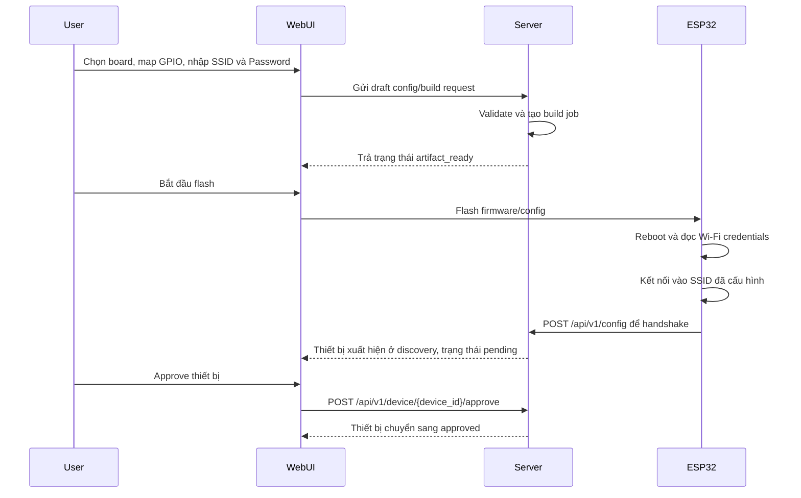

# ESP32 Wi-Fi Provisioning, Flash, and Pairing Workflow

## Mục tiêu

Tài liệu này mô tả workflow mong muốn cho thiết bị ESP32 trong E-Connect:

1. Cấu hình thiết bị trên WebUI.
2. Bắt buộc nhập thông tin mạng lần đầu trên WebUI gồm `SSID` và `Password`.
3. Build hoặc generate cấu hình để nạp vào ESP32.
4. Flash firmware cho ESP32.
5. Sau khi flash xong, ESP32 tự kết nối vào mạng đã khai báo.
6. ESP32 gửi yêu cầu pair với server.
7. Admin duyệt thiết bị trong luồng discovery để hoàn tất onboarding.

Workflow này bám theo lifecycle trong `PRD.md`:

- Build/flash lifecycle: `draft_config -> validated -> queued -> building -> artifact_ready -> flashing -> flashed`
- Device lifecycle: `flashed -> discovered -> pending authorization -> approved -> online`

## Thành phần tham gia

- `WebUI`: nơi user cấu hình board, pin mapping, Wi-Fi và khởi chạy build/flash.
- `Server`: validate cấu hình, tạo artifact build, nhận handshake từ ESP32 và đưa thiết bị vào danh sách chờ duyệt.
- `ESP32`: nhận firmware/config đã flash, kết nối Wi-Fi, rồi pair với server.
- `Admin`: người duyệt thiết bị tại màn hình discovery.

## Yêu cầu bắt buộc cho cấu hình mạng lần đầu

Khi user cấu hình một thiết bị ESP32 mới trên WebUI, form phải yêu cầu tối thiểu các thông tin sau trước khi cho phép build hoặc flash:

- `Device name` hoặc `Project name`
- `Board profile`
- `GPIO / pin mapping`
- `Wi-Fi SSID`
- `Wi-Fi Password`
- `Server endpoint` hoặc `MQTT broker` theo profile firmware đang dùng

Quy tắc bắt buộc:

- Không cho phép build hoặc flash nếu thiếu `SSID`.
- Không cho phép build hoặc flash nếu thiếu `Password` cho lần cấu hình đầu tiên.
- `SSID` và `Password` phải được đưa vào config hoặc artifact để ESP32 dùng ngay sau lần boot đầu tiên.
- Nếu user thay đổi cấu hình pin hoặc cấu hình mạng sau lần build gần nhất thì phải yêu cầu build lại trước khi flash.

## Workflow chi tiết

### 1. Tạo draft cấu hình trên WebUI

User vào luồng DIY Builder trên WebUI để:

- chọn loại board ESP32
- cấu hình pin mapping
- nhập `Wi-Fi SSID`
- nhập `Wi-Fi Password`
- nhập thông tin server hoặc broker cần dùng cho kết nối từ xa

Tại bước này, WebUI phải validate dữ liệu đầu vào và chặn luồng nếu còn lỗi.

### 2. Server validate và tạo config/build job

Sau khi user submit:

- WebUI gửi draft cấu hình lên server
- Server validate dữ liệu
- Nếu hợp lệ, server tạo config hoặc build job
- Server lưu trạng thái job để WebUI có thể theo dõi

Các trạng thái điển hình:

- `draft_config`
- `validated`
- `queued`
- `building`
- `artifact_ready`

Nếu validation fail thì phải trả lỗi machine-actionable và không tạo artifact để flash.

### 3. Flash firmware vào ESP32

Khi artifact đã sẵn sàng:

- WebUI mở web flasher
- User chọn cổng serial tương ứng với ESP32
- Nếu build flow đã tạo serial reservation cho cùng `serial_port`, hệ thống phải tự release reservation đó khi job chuyển sang `artifact_ready`
- WebUI chỉ cho phép bấm flash khi cổng serial đã rảnh; nếu còn serial session đang giữ cổng thì phải block và yêu cầu release trước
- Firmware được flash xuống thiết bị

Kết thúc bước này, trạng thái build/flash chuyển sang:

- `flashing`
- `flashed`

### 4. Hành vi của ESP32 sau khi flash

Ngay sau khi reboot lần đầu sau flash:

1. ESP32 đọc thông tin `SSID` và `Password` đã được nhúng trong config hoặc firmware.
2. ESP32 kết nối vào mạng Wi-Fi tương ứng.
3. Sau khi có mạng, ESP32 khởi tạo kết nối về server.
4. ESP32 gửi yêu cầu handshake hoặc pair lên server qua API onboarding.

Sau khi đã được approve và chạy bình thường:

5. ESP32 tiếp tục gửi heartbeat định kỳ lên server qua MQTT state topic.
6. Nếu server phản hồi rằng `device_id` không còn hợp lệ hoặc không còn ở trạng thái managed/approved, ESP32 phải coi đó là yêu cầu pair lại.
7. Khi nhận tín hiệu này, ESP32 phải gửi lại secure pairing request thay vì chỉ tiếp tục publish heartbeat mù.

Theo baseline PRD, yêu cầu pair ban đầu đi qua command path:

- `POST /api/v1/config`

Payload pair tối thiểu nên bao gồm:

- `device_id`
- `mac_address`
- `name`
- `firmware_version`
- `mode`
- `pins`

### 5. Discovery và phê duyệt trên server

Sau khi server nhận handshake:

- Server tạo mới hoặc cập nhật bản ghi thiết bị
- Thiết bị được đưa vào trạng thái `pending authorization`
- WebUI discovery hiển thị thiết bị trong danh sách chờ duyệt

Quy tắc visibility:

- Discovery và dashboard pairing notification chỉ được hiển thị khi board vừa gửi handshake/pairing request.
- Nếu admin gỡ board khỏi dashboard nhưng board vẫn còn firmware, thao tác unpair không được tự tạo thông báo pair.
- Board đó chỉ xuất hiện lại trong discovery sau khi nó chủ động gửi handshake mới; đây được coi là luồng recover cho trường hợp user xóa nhầm.

Admin vào màn hình discovery để:

1. nhìn thấy thiết bị mới
2. xác nhận đúng thiết bị
3. bấm approve để hoàn tất pair với server

Theo code path hiện tại, bước approve dùng endpoint:

- `POST /api/v1/device/{device_id}/approve`

Sau khi approve:

- thiết bị chuyển sang `approved`
- server có thể provision widget mặc định
- thiết bị được xem là đã pair thành công với hệ thống

### 6. Luồng tổng quát

### 7. Failure path cần chặn hoặc xử lý rõ

#### 1. Thiếu SSID hoặc Password

- WebUI không cho build
- WebUI không cho flash
- Hiển thị lỗi rõ ràng để user bổ sung thông tin mạng

#### 2. Sai mật khẩu Wi-Fi

- ESP32 flash thành công nhưng không join được mạng
- Thiết bị không xuất hiện ở discovery
- Thiết bị phải retry kết nối hoặc báo lỗi provisioning qua serial log

#### 3. Server không reachable

- ESP32 join được Wi-Fi nhưng handshake thất bại
- Thiết bị chưa được pair
- Thiết bị phải retry handshake theo cơ chế retry-safe

#### 4. Thiết bị chưa được admin approve

- Thiết bị đã gửi handshake nhưng vẫn ở trạng thái `pending authorization`
- Chưa được coi là online hợp lệ cho dashboard chính

#### 5. Thiết bị đã bị unpair khỏi dashboard

- Thao tác unpair chỉ đưa thiết bị về trạng thái chờ pair lại, không tự sinh pairing notification.
- Nếu board còn firmware và vẫn có thể kết nối server, heartbeat kế tiếp phải cho phép server yêu cầu pair lại, rồi board gửi handshake mới để re-enter discovery.
- Admin chỉ thấy thông báo pair lại sau handshake mới đó.

### 8. Acceptance criteria cho workflow này

- User bắt buộc nhập `Wi-Fi SSID` và `Wi-Fi Password` trên WebUI ở lần cấu hình đầu tiên.
- Không thể flash nếu thiếu thông tin mạng bắt buộc.
- Sau khi flash xong, ESP32 tự dùng thông tin đã nhập để kết nối mạng.
- Khi đã có mạng, ESP32 phải chủ động gửi yêu cầu pair tới server.
- Thiết bị phải xuất hiện ở discovery trước khi được approve.
- Pairing chỉ hoàn tất sau khi admin approve trên server.

## Ghi chú về hiện trạng code

Đối chiếu code hiện tại cho thấy:

- Backend đã có model `GenerateConfigRequest` với các field `wifi_ssid`, `wifi_password`, và `mqtt_broker`.
- Backend đã có luồng handshake thiết bị và approve device.
- Tuy nhiên, WebUI DIY builder hiện chưa thể hiện rõ field nhập `Wi-Fi SSID` và `Wi-Fi Password` trong code path đang có.

Vì vậy, để workflow này khớp hoàn toàn với yêu cầu sản phẩm, WebUI cần có bước nhập `SSID` và `Password` rõ ràng trước khi build hoặc flash.
